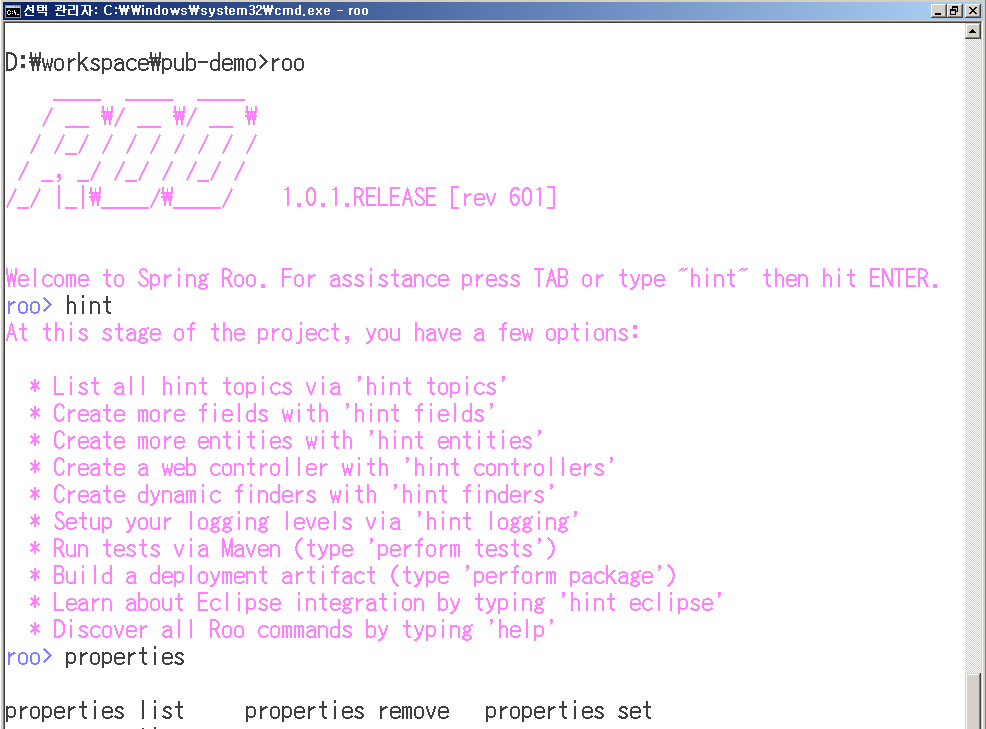
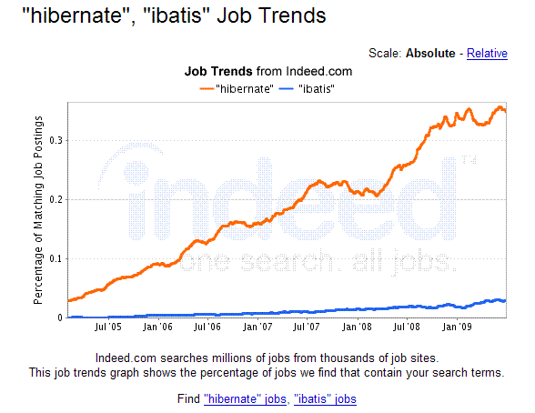

# Spring Roo와 함께 하는 쾌속 웹개발

2010-02-20

정상혁

---

### 목차

1. Tool
2. Demo
3. Application

---

## 1. Tool

- 1.1 개요
- 1.2 Command line shell
- 1.3 Round-trip
- 1.4 익숙한 도우미들

---

### 1.1 개요

Text Based RAD Tool for Java

- Real Object Oriented 의 첫 글자들
- Spring, Maven, JUnit 등 바탕의 코드 자동생성
- Round-trip 지원
- No Lock in, No runtime dependency
  - Roo 를 위한 인터페이스, 슈퍼클래스 없음
  - Roo 의 특성을 제거하기 쉬움

---

### 1.2 Command Line Shell

똑똑한 Shell 제공

- Tab completion
- Hint, Help
- Context-aware, Command hiding
- Script 기록, 실행
- 명령수행이 Transactional
  - 작업수행 중 이상하면 undo
- Backup

---

### 1.3 Round Trip

양방향 코드 자동생성

- 도구와 사람이 건드리는 파일 분리
  - 사람은 *.java, *.xml 만 신경쓰면 됨
- File system monitoring
  - Shell 이 떠 있는 동안에 자동 감지
  - .java, .xml 파일의 변화를 .aj 에 반영
- UI
  - 자동생성 여부는 옵션

---

### 1.4 익숙한 도우미들

Java 환경의 지원 도구들

- Maven
  - Library 관리. Build lifecycle
  - AspectJ 컴파일
- JUnit
- Selenium
- Eclipse
  - Spring Tools Suite
  - M2Eclipse
  - AJDT (AspectJ 지원 Plug-in)

---

## 2. Demo

- 2.1 Demo 진행
- 2.2 소스 분석

---

### 2.1 Demo 진행

작업 내용

- 프로젝트 생성
- Entity 추가
- Controller 추가
- Selenium 테스트 추가
- 테스트 코드 실행
- Tomcat 에서 실행
- Selenium 테스트 실행

---

### 2.1 Demo 진행

작업 내용

- Roundtrip 확인
  - Getter 추가, field 삭제
- Script 저장, Script 실행
- Backup
- Roo 제거

---

### 2.1 Demo 진행

화면



---

### 2.2 소스 분석

생성결과

- 모든 소스는 생략된 것이 아니고, 기능을 다 하는 클래스
- Entity class
  - 소스에는 getter/setter 가 없지만 Mixin 으로 생성됨

```java
@Entity
@RooEntity
@RooJavaBean
@RooToString
public class Guest {
    @Size(max = 30)
    private String name;
    private Integer price;
    private Boolean special;
}
```

---

### 2.2 소스 분석

생성결과

- Controller class
  - REST 의 CoC

```java
@RooWebScaffold(automaticallyMaintainView = true,
formBackingObject = Guest.class)
@RequestMapping("/guest/**")
@Controller
public class GuestController {
}
```

---

### 2.2 소스 분석

생성결과

- Test class
  - Assert 로직도 Mixin 으로 삽입됨

```java
@RooIntegrationTest(entity = Guest.class)
public class GuestIntegrationTest {
    @Test
    public void testMarkerMethod() {
    }
}
```

---

## 3. Application

- 3.1 구성기술과 구조
- 3.2 Spring 3.0
- 3.3 AOP
- 3.4 ORM
- 3.5 확장

---

### 3.1 구성기술과 구조

Full Stack, CoC

- 모든 Layer 기술을 다 제공
- Seam, Ruby on Rails 처럼 강한 주장이 있는 프레임웍
- Convention Over Configuration
  - Best practice 를 Convention 으로 심음

---

### 3.1 구성기술과 구조

단순 2단 구조

- Entity + Controller
  - Java 파일 단 2개
  - Active Record 패턴 적용
- DAO(Data Access Object) 와의 이별
  - Aspect 로 관심사의 분리
  - Static 메소드 테스트 기능 제공

---

### 3.1 구성기술과 구조

Active Record Pattern

- Domain object 에 Data access logic 이 들어감

```java
Guest guest = Guest.findByName("박성철");
guest.setSpecial(true);
guest.update();
```

---

### 3.2 Spring 3.0

Spring 3.0 기능활용

- REST convention support
  - [http://shopping.com/shop/product/](http://shopping.com/shop/product/)
  - [http://shopping.com/shop/product/1](http://shopping.com/shop/product/1)
  - [http://shopping.com/shop/product/1/form](http://shopping.com/shop/product/1/form)
- Beans Validation (JSR 303)

```java
public class Employee{
    @NotNull @Size(min=1, max=25)
    private String name;

    @NotNull @NumberFormat(style=Style.CURRENCY)
    private BigDecimal income = new BigDecimal("1000");
```

---

### 3.2 Spring 3.0

Spring 3.0 기능활용

- MVC custom name space

```xml
<mvc:view-controller path="/login"/>

<mvc:interceptors>
    <bean class="…ThemeChangeInterceptor"/>
</mvc:interceptors>
```

---

### 3.3 AOP

Bytecode weaving 적극 활용

- Roo 의 자동 생성 부분을 담당
- AspectJ 의 Inter-type Declaration 을 이용한 Mixin
  - Abstract subclassing, static crosscutting
  - Compile time 에서 코드 삽입
  - 성능 손해가 없음
  - Maven plugin 과 IDE 의 도움으로 별도 컴파일 필요 없음
- @Configurable 을 이용한 투명한 DI 기술
  - new 로 생성되는 객체에도 DI 적용 가능

---

### 3.3 AOP

Bytecode weaving 적극 활용

- Inter-type Declaration 으로 해결한 코드들
  - @Configurable 선언
  - Getter, Setter
  - 기본 CRUD 기능
  - Finder
    - 검색용 메소드 (findByName 류)
  - Entity 의 복수형
    - CoC 를 위해서 (Guest->Guests)
  - toString 메소드

---

### 3.4 ORM

ORM 에 대한 걱정들

- Object Relational Mapping
- 성능이 안 좋다?
  - 예측 가능한 SQL 로 대응 용이
  - 캐쉬, 분산환경 적용에 유리
    - 예) Tangosol Coherence Cache
- 복잡한 쿼리는 불가능하다?
  - 다양한 매핑 방식 지원 (Lazy loading, Join)
  - 필요하면 Native SQL 로 호출가능

---

### 3.4 ORM

ORM 의 확산

- 다른 언어에서도..
  - PHP(Zend, CodeIgniter), Python(Django), Ruby 등의
- Java 프레임웍도 '생산성'이라는 말을 위해서는..
  - JBoss Seam
  - Play framework
  - AribaWeb
  - Spring ROO

---

### 3.4 ORM

ORM 의 확산

- IT job trend



출처 : [http://www.indeed.com/jobtrends](http://www.indeed.com/jobtrends)

---

### 3.4 ORM

Roo 의 JPA 지원

- Provider 선택 가능
  - Hibernate, OpenJpa, EclipseLink
- "Open EntityManager in View" pattern 지원
  - OpenEntityManagerInViewFilter
  - View 에서 lazy loading 지원

---

### 3.5 확장

다양한 기술의 생성 도구로 활용 가능

- 기본 제공 Add-on
  - Spring Security, Spring webflow, JMS, SMTP 등
- Add-on 으로 확장가능 구조
  - Custom add-on 개발 가능
- 향후 지원 예정
  - Spring Batch, Spring Integration
  - Spring Blaze DS & Flex
  - GWT
- OSGi bundle 생성 가능

---

### 소감

또 한 번 봄의 시작이 되길..

- Dynamic typing 언어 진영의 발전에 대한 Java 진영의 대답
  - Open Class vs AspectJ Mixin
- 더 높은 추상화 수준으로 나아가기
  - 객체지향
  - Domain Specific Language
  - 실세계 언어와 유사한 표현을 목표로
- 과거의 유산 포용하기
- 만드는 즐거움

---

### 참고자료 URL

- [http://forum.springsource.org/showthread.php?t=71985](http://forum.springsource.org/showthread.php?t=71985)
- [http://www.ksug.org/101](http://www.ksug.org/101)
- [http://jaoo.dk/aarhus-2009/file?path=/jaoo-aarhus-2009/slides/RodJohnson_ExtremeJavaProductivityWithSpringRooAndSpring30.pdf](http://jaoo.dk/aarhus-2009/file?path=/jaoo-aarhus-2009/slides/RodJohnson_ExtremeJavaProductivityWithSpringRooAndSpring30.pdf)
