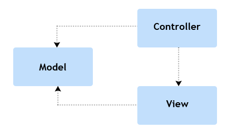
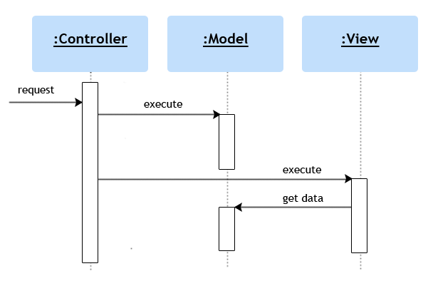
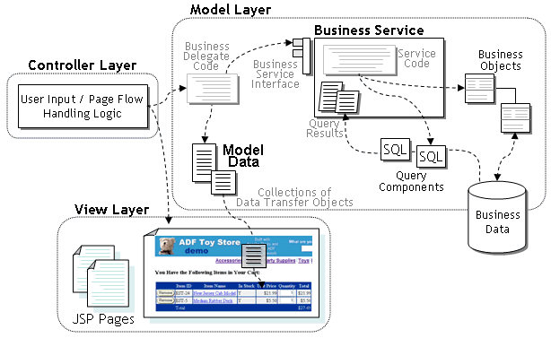
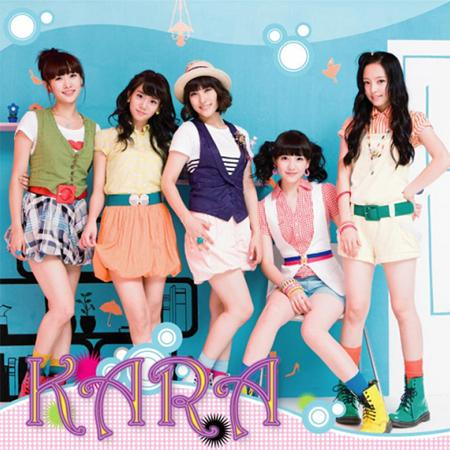

# 웹 프레임워크의 Web tier 처리방식과 Spring MVC

2010-05-29

정상혁, KSUG ([www.ksug.org](http://www.ksug.org))

---

### 목차

1. 웹 프레임워크 둘러보기
2. Spring MVC
3. 프레임워크 그 다음은…

---

## 1. 웹 프레임워크 둘러보기

1.1 MVC 동상이몽?

1.2 공통의 관심사

1.3 Ruby on rails

1.4 Django

1.5 CodeIgniter

1.6 Struts2

---

### 1.1 MVC 동상이몽?

#### MVC의 역할



그림출처 : [http://www.troika-asp.com/images/mvc.gif](http://www.troika-asp.com/images/mvc.gif)

---

### 1.1 MVC 동상이몽?

#### MVC의 역할

- Controller : 사용자의 입력을 받아서 Model의 상태를 변경, View에 전달
- Model : 도메인에 대한 정보
- View : Model을 UI에 나타냄

---

### 1.1 MVC 동상이몽?

#### 처리 흐름



---

### 1.1 MVC 동상이몽?

#### Web Application에서의 MVC

동의하십니까?



그림출처 : [http://www.oracle.com/technology/products/jdev/collateral/papers/10g/adftoystore/readme.html](http://www.oracle.com/technology/products/jdev/collateral/papers/10g/adftoystore/readme.html)

---

### 1.1 MVC 동상이몽?

#### Web Application에서의 MVC

- Domain Logic은 어디에?
- Model은 어느 것일까?
  - Service Layer + DAO or Data Transfer Object ?
- 혼란의 이유
  - 원래 웹이 아닌 GUI에서 나온 패턴
  - MVC는 Architectural Pattern
    - 하위 패턴은 다양할 수 있음
- Web Layer, Business Layer, Persistence Layer
- 향후 논의는 MVC의 가장 앞에서 말한 정의에 맞춰서 진행

---

### 1.2 공통의 관심사

#### Web tier에서 프레임워크가 하는 일들

- URL to Class Mapping
- Web parameter 전달
- View 파일 선택
- View로 Model 정보 전달
- 기타 웹에 특화된 처리
  - Cookie, Session, Header

---

### 1.2 공통의 관심사

#### 프레임워크 비교 - 분명 취향의 영역이 있다

<div style="display:flex; align-items:center; gap:30px;">
  
  <div style="font-size:2em; font-weight:bold;">VS</div>
  
</div>

---

### 1.3 Ruby On Rails

#### Url to Class Mapping

```text
http://www.ksug.org/liquor/list
```

…/controllers/liquor_controller.rb

```ruby
class LiquorController < ApplicationController
  def list
  end
end
```

…/config/routers.rb

```ruby
ActionController::Routing::Routes.draw do |map|
  map.connect ':controller/:action/:id'
end
```

---

### 1.3 Ruby On Rails

#### Web parameter 전달

```text
http://www.ksug.org/liquor/list?alcholRate=20
```

…/controllers/liquor_controller.rb

```ruby
class LiquorController < ApplicationController
  def list
    Liquor.findByAlcholRate(params[:alcholRate])
  end
end
```

---

### 1.3 Ruby On Rails

#### View 파일 선택 & 모델 전달

…/controllers/liquor_controller.rb

```ruby
class LiquorController < ApplicationController
  def edit
    @liquor =Liquor.findById(params[:id])
  end
end
```

app/views/liquor/edit.rhtml

```erb
…
<h2> <%=@liquor.name%> </h2>
…
```

디폴트 뷰가 아닐 때는 redirectTo, render 등의 메소드를 사용

---

### 1.4 Django(MVT)

#### Url to Class Mapping

```text
http://www.ksug.org/liquor/list
```

…liquor_views.py

```python
def list_page(req):
 …
```

…/urls.py

```python
urlpatterns = patterns('',
  (r'^liquor/list', liquor_views.list_page
)
```

---

### 1.4 Django(MVT)

#### Web parameter 전달

```text
http://www.ksug.org/liquor/list?alcholRate=20
```

…liquor_views.py

```python
def list_page(req, alcholRate):
   alcholRate = req.GET.get('alcholRate')
   …
```

---

### 1.4 Django(MVT)

#### Template 파일 선택 & 모델 전달

…liquor_views.py

```python
def edit_page(req, alcholRate):
  …
  context= {'liquor':liquor};
  return render_to_response('liquor_edit.html',
              context)
```

liquor_edit.html

```html
…
<h2> {{liquor.name}} </h2>
…
```

Redirect할 때는 HttpResponseRedirect객체 반환

---

### 1.5 CodeIgniter

#### Url to Class Mapping

```text
http://www.ksug.org/liquor/list
```

application/controllers/liquor.php

```php
class Liquor extends Controller {
  function list(){
  }
}
```

application/config/routes.php

```text
.. 재정의 할 때 등록
```

---

### 1.5 CodeIgniter

#### Web parameter 전달

```text
http://www.ksug.org/liquor/list?alcholRate=20
```

application/controllers/liquor.php

```php
function list () {
   $this->db->where('alchol_rate',
                $_GET['alchol_rate']);
   …
}
```

---

### 1.5 CodeIgniter

#### View 파일 선택 & 모델 전달

application/controllers/liquor.php

```php
function edit(){
 …
  $data['liquor'] = $this->db->get('liquor');
  $this->load->view('liquor_view', $data);
}
```

application/views/liquor_view.php

```php
…
<h2> <?=$liquor->name?></h2>
…
```

Redirect시는 redirect function 호출

---

### 1.6 Struts2

#### Url to Class Mapping

```text
http://www.ksug.org/liquorList.do
```

…org/ksug.action.LiquorAction.java

```java
public String list(){
……
}
```

…/struts.xml

```xml
<action name="LiquorList" class="…LiquorAction"
method="list"/>
</action>
```

ConventionPlugin, RestPlugin을 활용하면 CoC에 의한 설정 가능

---

### 1.6 Struts2

#### Web parameter 전달

```text
http://www.ksug.org/liquorList.do?alcholRate=20
```

…org/ksug.action.LiquorAction.java

```java
private double alcholRate
// setter 생략
public String list(){
   liquorService.findByAlcholRate(alcholRate);
}
```

Model-driven interceptor를 활용하면 model객체를 한번에 받는 것도 가능

---

### 1.6 Struts2

#### View 파일 선택 & 모델 전달

…org/ksug.action.LiquorAction.java

```java
private Liquor liquor;
//getter 생략
public String edit(){
   liquor =liquorService.findById(id);
   return "list";
}
```

…/struts.xml

```xml
<action name="LiquorEdit" class="…LiquorAction"
method="edit"/>
  <result name="list">/liquor/list.jsp</result>
</action>
```

---

### 정리

#### 유사한 요소를 기술하는 여러 표현방식들

- 유사한 구성 요소들
  - URL 매핑 정보를 기술, 입출력 값, View 지정
- 입력값과 출력값을 어떻게 처리하는가?
  - 입력값 : 멤버변수 vs 메소드 파라미터
  - 출력값: 멤버변수 vs 리턴값
- Script언어 vs Static typing 언어의 특성에 따른 차이

---

## 2. Spring MVC

2.1 Spring MVC의 방식들

2.2 Spring MVC의 외적 강점

---

### 2.1 Spring MVC의 방식들

#### Url to Class Mapping

```text
http://www.ksug.org/liquor/list
```

….LiquorController.java

```java
public @Controller class LiquorController

@RequestMapping("/liquor/list");
public String list(){
……
}
```

---

### 2.1 Spring MVC의 방식들

#### Web parameter 전달

```text
http://www.ksug.org/liquor/list?alcholRate=20
```

….LiquorController.java

```java
@RequestMapping("/liquor/list");
public String list(@RequestParam
                double alcholRate){
   liquorService.findByAlcholRate(alcholRate);
...
}
```

---

### 2.1 Spring MVC의 방식들

#### Web parameter 전달

```text
http://www.ksug.org/liquor/list/20
```

….LiquorController.java

```java
@RequestMapping("/liquor/list/{id}");
public String list(@PathVariable
                int id){
   liquorService.findById(id);
...
}
```

---

### 2.1 Spring MVC의 방식들

#### Web parameter 전달

- 기본적으로 올 수 있는 객체
  - HttpServletRequest, Response
  - Input/OutputStream, Reader, Writer
  - BindingResult

---

### 2.1 Spring MVC의 방식들

#### Web parameter 전달

- @ModelAttribute : 모델객체를 바로 파라미터로
- @SessionAttributes : 웹세션에 담겨있는 값을
- @RequestHeader, @RequestBody
- WebArgumentResolver
  - Request에서 매핑시키는 로직을 작성
  - 원하는 객체를 바로 파라미터로 넣을 수 있게함

---

### 2.1 Spring MVC의 방식들

#### View 파일 선택 & 모델 전달

….LiquorController.java

```java
@RequestMapping("/liquor/list/{id}");
public String list(@PathVariable
                int id, Map context){
   Liquor liquor = liquorService.findById(id);
   context.put("liquor", liquor);
   return "liquorList"; // view 정보
}
```

View정보가 어떻게 해석될지는 viewResolver에 의해 결정

---

### 2.1 Spring MVC의 방식들

#### View 파일 선택 & 모델 전달

….applicationContext.xml

```xml
<bean id="ViewResolver"
class="….InternalResourceViewResolver">
  <property name="prefix" value="WEB-INF/view/"/>
  <property name="suffix" value=".jsp"/>
</bean>
```

View name에 규칙(prefix, suffix)을 적용해서 파일 선택.

클래스당 설정 필요 없음

---

### 2.1 Spring MVC의 방식들

#### View 파일 선택 & 모델 전달

….LiquorController.java

```java
@RequestMapping("/liquor/list/{id}");
public Map list(@RequestParam
                int id){
   Map context = new HashMap();
   Liquor liquor = liquorService.findById(id);
   context.put("liquor", liquor);
   return context; // view 정보
}
```

리턴 타입은 String, Map, ModelAndView, ModelMap, void가 다 가능

---

### 2.2 Spring MVC의 외적 강점

#### 연관 기술들

- 다른 스프링 프로젝트와의 연관성
  - Spring Roo의 바탕
  - Spring core의 Remote Service
  - Spring Web service
  - Spring Batch admin
- Spring Tool Suite 도구 지원
- Spring Programming Model의 확산

---

## 3. 프레임워크, 그 다음은?

3.1 Spring programming model

3.2 플랫폼

---

### 3.1 Spring programming model

#### Spring 방식이란?

- IoC, AOP가 뒷받침하는 객체지향적 모듈 구성
- 프레임워크 자체가 모듈별 책임이 잘 분리된 모범 설계
  - 하위 호환성을 잘 유지하면서 발전
- 유연함, 확장성, 넓은 선택의 폭
- 이를 적용한 어플리케이션도
  - 인프라성 코드와 핵심 로직 코드의 분리

---

### 3.1 Spring programming model

#### Spring 방식이란?

- 다양한 환경의 이식성에 유리
  - Container 밖의 Test 코드
  - Local PC
  - OSGi
  - 전통적 데이터 센터의 서버
  - Cloud (제약된, 혹은 분산된 JVM? )

---

### 3.1 Spring programming model

#### Gemfire 에서 Spring IoC활용 사례

```java
public class Phonebook {
  private final Map<String, String> phoneNumbersByName;
  //setter생략
  public String getPhoneNumber(String name) {
    return phoneNumbersByName.get(name);
  }
  public void setPhoneNumber(String name,
                       String phoneNumber) {
    phoneNumbersByName.put(name, phoneNumber);
  }
}
```

[http://community.gemstone.com/display/gemfire/Integrating+GemFire+with+the+Spring+IoC+Container](http://community.gemstone.com/display/gemfire/Integrating+GemFire+with+the+Spring+IoC+Container)

---

### 3.1 Spring programming model

#### Gemfire 에서 Spring IoC활용 사례

테스트 혹은 Local 용 설정

```xml
<bean id="inMemoryPhonebookMap" class="java.util.HashMap" />

<bean id="phonebook" class="com.spring.example.Phonebook">
   <constructor-arg ref="inMemoryPhonebookMap" />
</bean>
```

---

### 3.1 Spring programming model

#### Gemfire 에서 Spring IoC활용 사례

실제 운영설정

```xml
<bean id="phonebookRegion" factory-bean="cache" factory-
method="getRegion">

<bean id="phonebook" class="com.spring.example.Phonebook">
   <constructor-arg ref=" phonebookRegion " />
</bean>
```

---

### 3.2 플랫폼

#### 라이브러리 vs 프레임워크 vs 플랫폼 ?

- 라이브러리는 개발자 코드에서 호출됨
  - Apache commons
- 프레임워크는 개발자 코드를 호출
  - 어플리케이션의 구조를 결정, 개발자 코드를 제어

> To me a framework is a way of thinking about a particular family of problems, and code to back it up.
>
> \- Kent Beck

---

### 3.2 플랫폼

#### 라이브러리 vs 프레임워크 vs 플랫폼 ?

- 플랫폼은 공통의 기술기반, 실행환경
  - Virtual Machine, Container, 미들웨어..

---

### 3.2 플랫폼

#### 플랫폼 경쟁

- 표준 논쟁의 대부분은 플랫폼 경쟁
  - 아이폰 OS vs 안드로이드
  - 실버라이트 vs 플래쉬
- 왜 민감한가?
  - 하드웨어, OS, 미들웨어 등 상용제품과 더 밀접한 관련
  - 라이브러리, 프레임워크에 비해 플랫폼 교체 비용이 더 큼
  - 네트워크 효과

---

### 3.2 플랫폼

#### 플랫폼과 개발환경

- 2008년 로드존슨의 인터뷰 중…

> 질문 : 10년 후 쯤에 사람들이 사용하게 될 프로그래밍 언어와 개발 환경은 어떤 특징들을 갖게 될까요?
>
> 로드존슨 : … 아마도 10년 쯤 흐른 후에는 더 이상 '언어' 수준에서는 프로그래밍하지 않을 것이며 점진적으로 '플랫폼' 수준으로 될 거라 봅니다.
>
> \- Secrets of the Rock Star Programmers 중

---

### 3.2 플랫폼

#### 최근 SpringSource의 행보들..

<div style="display:flex; flex-direction:column; gap:40px; margin-top:30px;">
  <div style="display:flex; align-items:center; gap:60px;">
    
    <span>Messaging solution</span>
  </div>
  <div style="display:flex; align-items:center; gap:60px;">
    
    <span>Force.com DB : 데이터 저장소</span>
  </div>
  <div style="display:flex; align-items:center; gap:60px;">
    <span style="display:flex; align-items:center; gap:10px;"></span>
    <span>Google App Engine으로의 배포도구 통합 지원</span>
  </div>
</div>

---

### 3.2 플랫폼

#### 어떤 방향으로 더 발전할까?

- Cloud 환경을 더 편하게 지원하는 도구
  - 프레임워크에 특화된 정보를 제공하는 모니터링 도구
  - 배포 도구
- 기존 인터페이스를 유지하면서 Cloud를 지원하는 인프라성 모듈
  - 제약된 혹은 분산된 JVM 지원
  - 분산 저장소를 지원하는 인프라 코드
    - JPA 구현체, Grails + Force.com DB 등

---

### 마치며…

#### Spring 방식의 웹개발은..

- Spring MVC의 유연성, 빠른 발전 속도
- Spring에 특화된 개발/프로파일링 도구 지원 강화
- Spring portfolio의 성장
- 플랫폼, 도구 지원
- Spring programming model -> Portability 강점

- 어떤 취향은 큰 흐름으로…
