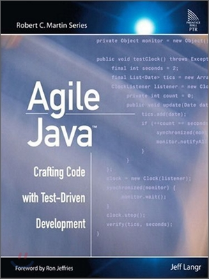
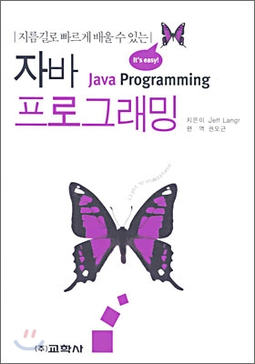
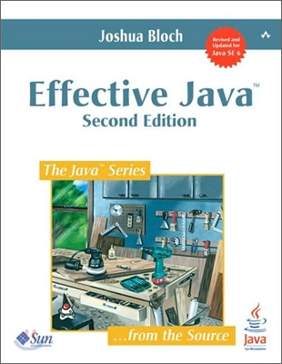
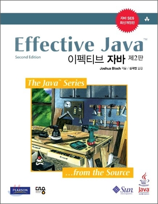
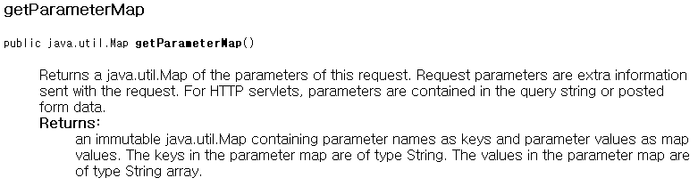
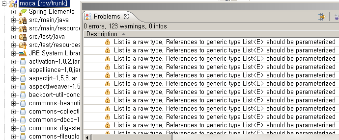
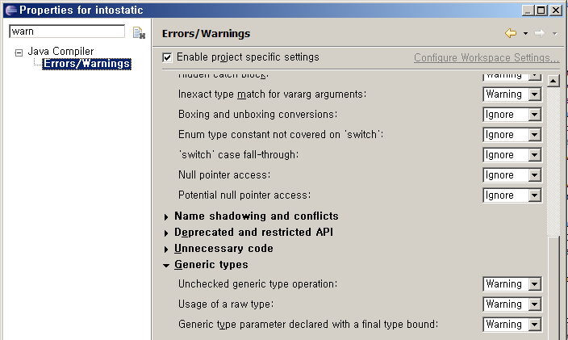
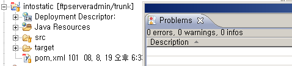

# Effective & Agile Java

2010-08-14

정상혁

---

### 강사 소개

**정상혁, NHN 생산성 혁신팀**

- 이력
  - 2004.01 ~2008.02 : 삼성 SDS S/W Eng. 팀
  - 2008.02 ~2010 : NHN corp.
- Server side Java 개발자 (웹, 배치 어플리케이션)
- TDD, Unit test, Spring 등 사내 교육 강사
- 주로 Server-side의 scalability 문제해결과 test 자동화에 관심
- [benelog@gmail.com](mailto:benelog@gmail.com)
- [http://benelog.egloos.com](http://benelog.egloos.com),
- [http://benelog.springnote.com](http://benelog.springnote.com)

---

### 목차

1. 과정 소개
2. 업계 흐름
3. 코드 지향 방향
4. Android 환경 구축 실습

---

## 1. 과정 소개

- 1.1 전달하고자 하는 것
- 1.2 사용할 수단
- 1.3 남았으면 하는 것
- 1.4 장애물
- 1.5 참고 도서

---

### 1.1 전달하고자 하는 것

**실무 협업에서 매일 강조되는 것들**

- Clean code that works
- Testable code == Good Design
- Test == Spec
- 개발 과정 중의 빠른 피드백의 중요성
  - 생산성, 효율성
  - 성취감, 집중력
- 탄탄한 언어 기초를 시작점으로 …

---

### 1.2 사용할 수단

**강추 도서, 흥미 있는 구현 기술**

- 참고도서 내용 중 자주 인용될 만한 것들을 위주로
- Android
  - 최근 뜨는 기술 살짝 맛보기
- 과제
  - 스스로 구현할 만한 자신이 있는 정도의 작은 어플
  - 두 가지 관점의 명세 정리
  - 기능보다는 코드의 충실성을 평가

---

### 1.3 남았으면 하는 것

**어떤 분야를 공부하더라도 변하지 않는 기본**

- 이런 것들 다 공부하려면 몇 년은 걸리겠군 …
- 무엇에 집중할 것인가를 결정하는데 도움이 되는 정보
- 어떤 주제, 구현 기술이던지 같이 적용될 수 있는 것들

---

### 1.4 장애물

**폭넓은 주제, 특정 구현 기술**

- Android의 특수성, 특이한 관습
  - 예)Junit3 바탕, m을 붙이는 멤버변수 명명법
- 짧은 과정, 바쁜 강사
- 특이해 보이는 마에스트로 과정
- 어떻게 극복할 것인가?
  - 각자 과제를 수행하면서도 서로 도와 주기
  - 추가 학습 주제에 대한 자료 제공

---

### 1.5 참고도서

**Agile Java : Java 기초를 TDD로**

- TDD의 명세화, 학습 테스트 측면

<div class="flex gap-8">
  
  
</div>

---

### 1.5 참고도서

**Effective Java : Java 개발의 핵심**

- TDD의 명세화, 학습 테스트 측면

<div class="flex gap-8">
  
  
</div>

---

## 2. 업계 흐름

- 2.1 개발 도구의 전문 분야화
- 2.2 SW 공학 환상에서 깨어나다
- 2.3 Server-side의 소화불량
- 2.4 Rich client 기술의 난장
- 2.5 Java 위에서 Java를 뛰어넘기
- 2.6 기업, 씀씀이를 되돌아보다
- 2.7 해결사가 필요해요

---

### 2.1 개발 도구의 전문화 분야화

**코딩만 알아서는 일을 못하는 시대 ..**

- 버전 관리시스템 : SVN, Git
- 이슈 관리 : Jira 등
  - 예) [https://jira.springframework.org/browse/BATCH](https://jira.springframework.org/browse/BATCH)
- 빌드 도구
  - Maven, Ant
- Continuous Integration
  - Hudson, Bamboo
- 업계가 공통적인 문제해결 방식을 공유하고 있음

---

### 2.2 SW 공학, 환상에서 깨어나다

**전통적 방법론의 실패**

- Waterfall의 실패
  - 요구사항이 안 바뀌는 프로젝트는 없다
- 테일러리즘과 S/W 개발
  - 경영층의 반복적인 환상
  - S/W에 명시적인 공정제어 모델들은 적합하지 않다
  - 그러나 제조업에서의 교훈은 얻을 수 있다
    - 린소프트웨어, 칸반 시스템
    - 제조업의 품질 활동 (생산라인을 멈출 수 있는 권한?

---

### 2.2 SW 공학, 환상에서 깨어나다

**점진 반복적 개발, Agile이 해법으로 ..**

- Working software에 중심 가치
  - 문서를 안 만들자는 것이 아니다!
- 매일 고객에게 우리의 가치를 전달한다
- Scrum : 이슈, 일정 관리 기법으로 국내에서도 확산
- TDD, CI, Pair programming…
- Iteration
  - RUP 등에서도 도입된 방식
  - 빠른 피드백, 완결함으로 인한 동기 유발
  - 강의도 2시간짜리가 6번 있었으면 …

---

### 2.3 Server-side의 소화불량

**데이터 증가량을 받아주는 기술이 필요하다**

- SW 발전 속도 < HW 발전속도
  - 병렬 CPU 활용 기술은 OS가 못 받쳐주는 경우도 ..
- HW 발전속도 < 데이터 증가량
- RDB의 한계 : 비싼 클러스터링 비용
- Twitter, Facebook 사례
- 다양한 저장소 전략
  - Cache farm Memcached
  - Cloud repository (NoSql)
  - 검색 Index(DB의 like 검색으로는 안 먹힘)

---

### 2.3 Server-side의 소화불량

**다양한 저장소 전략**

- Cache farm : Memcached
- Cloud repository, NoSql
  - Hadoop
  - Big Table, Casandra, MongoDB,
- 검색 Index(DB의 like 검색으로는 안 먹힘)
- 이 다양한 저장소를 어떻게 동기화할 것인가의 이슈
  - 이벤트 발생 방식 (time based, user event)
  - Push, Poll 방향

---

### 2.4 Rich Client 기술의 난장

**UX의 부가가치**

- 인지 과부하의 시대
  - 인지 과학, 뇌과학, 심리학 측면 연구가 더 활발해질 것
- 최후의 차별화 요소
  - 기능이 다 비슷하고, 데이터 이식성도 이루어진다면?
- 갈수록 높아지는 사용자의 기대 수준
  - Rich & Heavy 해 지기 ㅟ움
  - 그래도 느리면 못 참음

---

### 2.4 Rich Client 기술의 난장

**UX 플랫폼의 혼란**

- 2004~2005년경만해도 IE면 만사형통
- SI에는 xInternet 솔류션
  - 기본 Client-Server 환경의 MIS 프로그램 대체
- Ajax, Flash, HTML5, JavaFX, Silverlight
- 다양한 이벤트 모델
  - Service-side push, Long polling
  - Reverse Ajax, Comet 등의 기술 활용
- 어느 기술에 줄을 서야 할까?

---

### 2.5 Java 위에서 Java를 뛰어넘기

**JVM을 바탕으로 하는 기술의 성숙**

- 여전히 Java 자체도 세계에서 가장 많이 쓰는 기술
- 느린 발전 (C# 등과 비교)
  - 많은 이해 당사자, 신중한 합의과정
- Groovy, Scalar,Clojure 등 JVM 위의 다른 언어가 뜨고 있음
  - 아직은 조기수용자 집단
- 세월이 지나면 Java 자체가 Low-level 언어처럼 될지도
  - GC가 안 되는 다른 언어가 지금 그렇듯이
- 그러나 JVM의 성숙도는 버리기 힘듬
  - JVM 실행환경은 그대로 계승되거나 적어도 이론적 계승

---

### 2.6 기업, 씀씀이를 되돌아보다

**장비의 투자대비 효과(ROI)를 고민하다**

- IT 거품의 시대를 지나서, 도입보다는 성숙한 운영의 시대
- H/W 비용
  - CPU가 놀고 있는 장비들은 어디에나 흔할 것
  - Green IT 이라고 이름 붙이고 '전기비 절감'이라 읽는다
  - 인프라수준의 클라우드 시장

---

### 2.6 기업, 씀씀이를 되돌아보다

**언제나 '차세대'를 개발할 수는 없다**

- 반복되는 신규 프로젝트 비용
  - 위험성이 큼 (데이터 전환 등)
  - 레가시는 자산이자 부채
    - 시장 대응 속도 결정
- 소프트웨어 키워가기
  - '앞으로 60년 후에는 대부분의 개발자는 자기의 나이보다 더 많은 시스템을 유지보수하고 있을 것이다' 랄프 E 존슨
- 완성도 있는 코드의 가치가 커짐
  - 좋은 설계, Testablility, 리팩토링
  - 사람에 가까운 코드, High level의 가치

---

### 2.7 해결사가 필요해요

**아키텍처가 더욱 중요해지는 시대 …**

- server, client 등의 수많은 도전 과제
- 결국 사람이 하는 일은 의사결정과 그 표현
  - 작은 단위의 표현 – 코딩
  - 큰 단위 – 서버 구성, 솔류션별 역할, 이벤트 구조 설계
- 큰 단위의 의사 결정을 하려면
  - Low to High level까지의 모든 지식이 필요
  - 그 외 의사 소통 기술

---

### 2.7 해결사가 필요해요

**수많은 도전 과제들이 있지만 …**

- 현장 인력이 공부할 시간이 부족해 보임
  - 예) java.util.Collection의 하위 인터페이스는?
- 세계적으로 쏟아지는 지식들 …
  - 한국 번역판을 기다릴 수 없음

> "당신의 평판은 어떤 지식을 알고 있느냐가 아니라 학습하는 능력이 얼마나 좋은지를 기반으로 쌓여갈 것이다."
>
> ('프로그래머의 길, 멘토에게 묻다' 중에서)

---

### 2.7 해결사가 필요해요

**수많은 도전 과제들이 있지만 …**

- 한국 IT의 우울
  - Tmax, 한컴이 매물로 …
  - Global Scale이 있는 업체의 시장 잠입
    - Facebook, Twiiter
    - 한국 지사도 없는 업체?
- 개발 언어도 영어
  - Domain Driven Design 에서도 불리
- 규모의 경제의 한계

---
layout: image-right
image: ./conductor.png
backgroundSize: contain
---

### 2.7 해결사가 필요해요

**SW 마에스트로 과정?**

- 이런 느낌
- 지휘자도 악기 하나는 잘 다룬다?

---
layout: image-right
image: ./chef.png
backgroundSize: contain
---

### 2.7 해결사가 필요해요

**SW 마에스트로 과정?**

- 또는 이런 느낌

---

### 2.7 해결사가 필요해요

**SW 개발 VS 요리**

> 라면을 끓이는 것은 쉬운 일이나
> 300명이 먹을 라면을 끓이는 건 다르다
>
> ([http://www.slideshare.net/k16wire/ss-4769213](http://www.slideshare.net/k16wire/ss-4769213) 중에서)

---

### 2.7 해결사가 필요해요

**SW 개발 VS 요리**

- 요리사는 많다
  - 재료 선정부터 레시피 개발까지 모든 것을 다 아는 요리사는 드물다
  - 한식, 양식 등 분야가 다르면 다른 전문가가 있지만, 어디에서나 통하는 기본기는 있다
- 개발자는 많다
  - 중요한 기술적 의사 결정을 할 수 있는 개발자도 드물고
  - 작은 의사결정의 표현인 코드를 잘 짜는 개발자도 드물다

---

### 2.7 해결사가 필요해요

**무엇을 하고 싶으세요?**

- 앞으로 10년, 20년, 30년 후의 자신의 모습을 이야기하라고 할 때, 구체적으로 이야기할 수 있는 사람일 수록 실제로 그렇게 될 가능성이 높다고 합니다.
- 만나 보고 싶은 분야의 전문가가 있으면 이야기해 주세요

---

## 3. JUnit 기초

- 3.1 JUnit3
- 3.2 JUnit4

---

### 3.1 JUnit 3

**상속, 메서드 이름 규칙**

- extends TestCase
- test
- setUp, tearDown
- assert
- 멤버변수의 생성주기 유심히 살펴보기

---

### 3.2 JUnit 4

**Annotation, static import**

- @Before
- @After
- @Test
- @BeforeClass, @AfterClass
- Effective Java 2nd Edition Item 35
  - Prefer annotations to naming patterns

---

### 3.3 실습

**main 대신에 @Test**

- BigDecimal 동작의 삽질 케이스
- url to file
  - `download(String url, String fileName)`
- 두 개의 Java Date 클래스를 받고
  - 현재 날짜, 입력날짜
  - 24시간 전이면 'x 시간전'으로 표시
  - 24시간 ~ 48시간이면 어제
  - '48시간 ~ 56시간'이면 그저께
  - 나머지는 'x'일전

---

## 4. 코드의 지향 방향

- 4.1 이름 짓기
- 4.2 Generics
- 4.3 Enum
- 4.4 변수의 범위
- 4.5 Exception 처리

---

### 4.1 이름 짓기

**결국은 글쓰기의 일종**

> 컴퓨터가 이해할 수 있는 코드는 어느 바보나 다 짤 수 있다. 좋은 프로그래머는 사람이 이해할 수 있는 코드를 짠다.
>
> \- 마틴파울러 (리팩토링 중)

> 프로그램은 오직 사람이 읽기 위해서 작성되어야 한다. 컴퓨터가 그것을 실행하는 것은 부차적인 일이다.
>
> \- 컴퓨터 프로그램의 구조와 해석 (Structure and Interpretation of Computer Programs) 서문

---

### 4.1 이름 짓기

**이름 짓기의 원칙**

- 문서 없이도 API의 기능이 직관적으로 들어올 수 있는 이름
- 좋은 이름은 좋은 개발을 이끔
  - 이름 짓기 힘들다면 좋지 않은 설계의 징후
- 문제지향성 (Problem orientation)
  - '어떻게'보다 '무엇'을 표현
  - 역할 제시형 작명 (result,each, count)
- 의도제시형 이름
  - Customer.linearCustomerSearch -> Customer.find
- 쓰는 사람의 입장에서
- 전체 API에 걸쳐서 일관성이 있는 이름
- 단순한 상위클래스, 중요한 클래스는 한 두단어로

---

### 4.1 이름 짓기

- 발음할 수 있는 이름으로
- 범위가 클 수록 상세하게
  - local 변수보다는 멤버변수가 더 자세한 이름이
- `Map<String,Object> map` 보다는 `Map<String,Object> response`
- a,b,c,d a1,b1 등은 피하자
  - Loop에서 i, j는 아주 오랜 관습이라서 예외적

---

### 4.1 이름 짓기

**참고자료**

- Code Completed 2nd Edtion
  - Ch 6.2 클래스의 이름
  - Ch 7.3 루틴의 이름
  - Ch 11 변수 이름의효과
- 켄트백의 구현패턴
  - 101페이지, 128페이지, 53페이지
- Clean code – Rober c Martin

---

### 4.2 Generics

**Generics 활용**

- Compile time의 에러 체크 범위가 늘어남
  - Casting 없앰 -Class Cast Exception 걱정 덜기
- 코드의 표현력이 높아짐
  - 메서드 시그니처만 봐도 어떤 형이 들어 있는지 파악

**Generics 주의할 점**

- `List<String>`은 `List<Object>`의 하위 클래스가 아니다.
  - `List<Object>.add(String)` 은 되지만
  - `List<Object> myList = new ArrayList<String>();` 은 에러
  - Wild card로 범위지정
    - `List<? Super String)`

---

### 4.2 Generics

**활용 원칙**

- 꼭 필요할 때만 SuppressWarnings
- 어쩔 수 없는 warning도 있다
  - Generics를 지원하지 않는 외부 API 사용
  - 배열 생성
  - `@SuppressWarnings("unchecked")`
- 지정범위는 최대한 좁게
  - 메소드 범위나 Class 범위의 지정은 자제

```java
public String intercept(ActionInvocation invocation) throws Exception {
    Object action = invocation.getAction();
    if (action instanceof ParameterMapAware) {
        HttpServletRequest request = ServletHelper.getRequest( invocation);
        if (!(request instanceof MultiPartRequestWrapper)) {
            @SuppressWarnings("unchecked")
            Map<String,String[]> requestMap = request.getParameterMap();
```

---

### 4.2 Generics

**활용 원칙**



**Key=String, Value=String Array**

**API 문서를 믿고 warning을 밟아줌**

```java
@SuppressWarnings("unchecked")
Map<String, String[]> requestMap = request.getParameterMap()
```

---

### 4.2 Generics

**Generics를 활용하지 않아서 생기는 warning들**

- 이대로는 Eclipse의 warning 표시 기능이 의미 없어짐



---

### 4.2 Generics

**Legacy 코드에 의한 warning이 너무 많을 때**

- Eclipse 설정으로 warning 제외
  - Project – Properties - Java Compile -Errors/Warnings



---

### 4.2 Generics

**0 warning Project 목표하기**



---

### 4.2 Generics

**참고자료**

- Effective Java 2판 – Chapter 5
  - Item 23 : Don't use raw types in new code
  - Item 24: Eliminate unchecked warnings
  - Item 25: Prefer lists to arrays
  - Item 26: Favor generic types
  - Item 27: Favor generic methods
  - Item 28 : Use bounded wildcards to increase API flexibility
  - Item 29: Consider typesafe heterogeneous containers

---

### 4.2 Generics

**참고자료**

- Agile Java
- [http://java.sun.com/j2se/1.5/pdf/generics-tutorial.pdf](http://java.sun.com/j2se/1.5/pdf/generics-tutorial.pdf)
- 월간 마이크로소프트웨어 2004년 12월 Java 제네릭스에대한 실제적 고찰
- [http://www.ibm.com/developerworks/kr/library/j-jtp04298.html](http://www.ibm.com/developerworks/kr/library/j-jtp04298.html)

---

### 4.3 Enum

**Enum 활용 장점**

- 코드 가독성을 높인다.
  - Magic Number?

```java
void method (User user){
  user.setStatus(3); //??
  dao.update(user);
}
```

- 컴파일 타임에 에러 체크 (오타 걱정이 없다.)

---

### 4.3 Enum

**Enum 활용 활용 사례**

```java
public enum FtpAuthStatus {
  APPLIED("1"), GRANTED("2");
  private final String value;

  FtpAuthStatus(String value) {this.value = value;}
  public String getCode() {return value;}
}
```

```java
ftpServerAdminBO.insertFtpAuth(params, FtpAuthStatus.APPLIED);
```

```java
if(status==FtpAuthStatus.GRANTED){
  params.put("grantedTime", now);
}
```

---

### 4.4 변수의 범위

**차이점은?**

```java
static int countOfIncluded(List lines, String word){
    int count = 0;
    String element = "";
    for (int i=0,n=lines.size();i<n;i++){
        element = (String) lines.get(i);
        if (element.indexOf(word)!= -1 ) count++;
    }
    return count;
}
```

VS

```java
static int countOfIncluded(List lines, String word){
    int count = 0;
    for (int i=0,n=lines.size();i<n;i++){
        String  element = (String) lines.get(i);
        if (element.indexOf(word)!= -1 ) count++;
    }
    return count;
}
```

---

### 4.4 변수의 범위

**루프 밖에서 초기값 객체 생성**

- Loop 안에서 새로 받을 값이므로 초기값이 필요 없다.
- 앞 장의 코드의 경우는 빈스트링("") 대입이 필요 없는 객체
- new로 생성하는 경우도 필요 없이 하지 말자
- 특별히 도움되는 것이 없는데 메모리 공간, 성능, 소스 길이에 다 손해를 입히는 코드

```java
Map row = new HashMap();
for(int i=0,n=selected.size();i++){
        row = (Map) seleted.get(i);
        ……
}
```

---

### 4.4 변수의 범위

**반복되는 변수를 Loop 밖에서 선언 vs 안에서 선언**

- javap –c 로 바이트코드 분석해 보면 똑같음
- Java Virtual Machine Spec 2nd Edition, 3.6장
- 메소드 안의 local variable들의 값들은 고정된 크기의 배열에 저장되고 그 배열의 크기는 compile 시에 결정
- 루프의 길이에 따라 local variable의 값이 저장되는 공간 (객체가 저장되는 공간인 Heap이 아닌 Stack 영역)의 크기가 달라진다면 JVM의 스펙과 어긋남

```java
User admin = new User();
```

스택과 힙 메모리에 저장되는 것은 각각 어느 부분?

---

### 4.4 변수의 범위

```java
static int countOfIncluded(List lines, String word){
    int count = 0;
    for (int i=0,n=lines.size();i<n;i++){
       String  element = (String) lines.get(i);
        if (element.indexOf(word)!= -1 ) count++;
    }
    return count;
}
```

element가 밖에 선언 되었다고 해서 힙메모리에 객체가 덜 생성되는 것도 아니고, Stack 메모리에 변수 선언 공간을 덜 차지 하는 것이 아님

element는 힙메모리에 생성된 객체 그 자체가 아니다 (객체를 가르키는 리모컨 같은 것)

---

### 4.4 변수의 범위

**Java5에서의 Loop문**

- forEach를 활용

```java
static int countOfIncluded(List<String> lines,
                                    String word){
  int count = 0;
  for (String line:list){
    if (element.indexOf(word)!= -1 ) count++;
  }
  return count;
}
```

---

### 4.4 변수의 범위

**멤버 변수 남용 않기**

- 성능에 손해
- 정말 그 객체의 멤버로써 의미가 있을 때만
  - Person의 속성으로서 temp는 무슨 의미?

```java
Class Person{
  String  temp;
  void work(List list){
     for (int i=0; i = worksToDo.size(); i++){
     temp = (String) worksToDo.get(i);
     // 기타 ...
   }
  }
  void play(List list){
     for (int i=0; i = playStuff.size(); i++){
     temp = (String) playStuff.get(i);
     // 기타 ...
    }
  }
}
```

---

### 4.4 변수의 범위

**변수의 선언 범위 원칙**

- 필요 없는 초기값 없이
- 최소한의 범위로
  - 변수 수명을 최소화
- 쓰이기 전에 바로

**기대 효과**

- 개발자의 머리를 더 가볍게
  - 블록을 벗어나면 그 변수에 대해서는 잊어 버리자
- Garbarge Collection 시점 차이도 있음

---

### 4.4 변수의 범위

**반복적일 필요 없는 작업을 Loop 안에서 하지 않기**

- Loop 안에서 값이 변하지 않는 것은 1번만 호출

```java
for(String userId : userIdList){
  UserBO bo = (UserBO) context.getBean("userBO");
  bo.deleteUser(userId);
}
```

- UserBO가 다른 곳에서 쓰이는 곳이 없다면 Loop 안이 최소 사용 범위이지만, userBO의 값은 loop 안에서는 변하지 않으므로 밖으로 빼는 것이 좋음

---

### 4.4 변수의 범위

**참고자료**

- Effective Java 2nd Edition, Joshua Bloch 저
  - Item 45 - Minimize the scope of local variables
  - Item 46 – Prefer for-each loops to traditional for loops
- 자바퍼포먼스 튜닝, Jack Shirazi 저 서민구 역
  - 11장 적절한 자료구조와 알고리즘
  - 질의 최적화 - 불필요한 반복적 메소드 호출 제거
  - 6장 예외 단언, 캐스팅, 변수 - 변수
- Code completed 2nd Edtion, Streve McConnell 저 서우석 역
  - 10장 변수사용 시 일반적인 문제
  - 10.3 변수의 초기화에 대한 지침
- [http://benelog.egloos.com/1382604](http://benelog.egloos.com/1382604)

---

### 4.5 Exception 처리

- 반드시 예외적인 경우만
  - if 으로 대체할 수 있는 것인지 고민
  - 100% Exception이 나는 경우라면 Exception이 아니다
- 그냥 버리지 않기
- Checked Exception을 남용하지 않기
  - Alternative return value 로서의 가치가 있을 때만
  - [http://benelog.egloos.com/1901121](http://benelog.egloos.com/1901121) 참조
- Java.lang.Exception 보다는 되도록 구체적인 Exception으로
  - throws Exception은 최후의 수단
- 기본 Exception 잘 활용하기
  - IllegalArgumentException, IllegalStateException

---

### 4.5 Exception 처리

**Effective Java 2nd Edition**

- Item 57 : Use exceptions only for exceptional conditions
- Item 58 : Use checked exceptions for recoverable coditions, and run-time exceptions for programming errors
- Item 59 : Avoid unnecessary use of checked exceptions
- Item 60 : Favor the use of standard exceptions
- Item 61 : Throw exceptions appropriate to the abstraction
- Item 62: Document all exceptions thrown by each method
- Item 63 : Include failure-capture information in detail message
- Item 64 : Strive for failure atomicity
- Item 65 : Don't ignore exceptions

---

### 4.6 중복 제거

- 리팩토링 : '중복을 없애고 의도를 명확히 드러내는 것'
- 가장 자주 하는 리팩토링 기법
  - 메서드 정리
    - Refactoring( 마틴파울러 ) chapter 6
    - 한 메서드는 한 화면에 들어올 정도로 정리
- 3번 이상 중복이면 리팩토링 대상
- 작은 리팩토링의 예

```java
ServiceContext.setAttribute("message", message);
```

- 위의 코드가 3번 나온다면?
- setMessage라는 메소드로 빼라.
- "message"를 오타칠 위험을 없애준다.

---

### 4.7 API 설계 원칙

- 사용하기 쉬워야 하고, 오용하기 어려워야 한다.
- 되도록 빠른 시점에 에러를 보고하고 컴파일 타임이면 가장 좋다.
- 가능한 많은 부분은 private 한 영역으로
- 가능한 작으면서도 충분하게. 한가지 일만하게. API가 향후 기능이 추가되기는 쉬워도 들어간 기능이 빠지기는 힘들다.
- API 내부에서 할 수 있는 일을 API를 사용하는 Client가 하게 내버려 두어서는 안 된다.
- 구현이 API에 영향을 미치면 안된다.

---

### 4.7 API 설계 원칙

**참고자료**

- How to Design a Good API & Why it matters - Joshua Bloch
  - [http://www.infoq.com/presentations/effective-api-design](http://www.infoq.com/presentations/effective-api-design) (Javapolis 2005)
  - [http://video.google.com/videoplay?docid=-3733345136856180693](http://video.google.com/videoplay?docid=-3733345136856180693) (google에서 강연)
- Bumper-Sticker API Design - Joshua Bloch

---

## 4. Android 실습 환경 구축

- 1.1 설치
- 1.2 샘플 프로젝트

---

### 4.1 설치

**실습**

- [http://justice0223.blog.me/10087087007](http://justice0223.blog.me/10087087007)

---

### 4.2 샘플 프로젝트

**실습**

- SDK 안의 samples 디렉토리 참조
