# SpringOne2GX 2010 참석 후기

2010-11-13

정상혁

---

### 발표자 소개

**정상혁**

- NHN 생산성 혁신팀, 기술 지원 업무
- 블로그 : [http://benelog.egloos.com](http://benelog.egloos.com)
- 위키 : [http://benelog.springnote.com](http://benelog.springnote.com)
- SNS : [http://me2day.net/benelog](http://me2day.net/benelog)

---

### 목차

1. SpringOne과 Social Service
2. 주요 내용 – 스프링의 다음 발걸음
3. 분석 – 스프링을 둘러싼 전략들

---

## 1. SpringOne과 Social Service

- 1.1 행사소개
- 1.2 TripIt
- 1.3 Twitter
- 1.4 Spring Social

---

### 1.1 행사 소개

**SpringOne2GX 2010**

- Spring과 Groovy를 주제로 여는 컨퍼런스
- SpringSource 주최 (Divison of VMWare)
  - Java의 주요 오픈 소스 개발 주도 업체
    - Spring, Aspect J, Groovy-Grails
    - Tomcat, Apache Httpd의 핵심 Commiter


---

### 1.2 TripIt

**참석 준비 중 Tripit을 알게 됨**

- 여행정보 관리 사이트

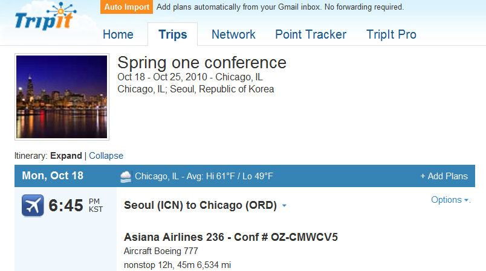

---

### 1.2 TripIt

**어쩌다 보니 사용자가 됨**

- 셔틀버스 예약 사이트에서 tripit.com 연결
- 가입이 귀찮았는데, google 계정 사용 가능
- 셔틀버스 정보가 자동 입력
- 항공편 번호만 입력
- 메모용으로 숙소 전화번호 정보를 수동 입력

---

### 1.2 TripIt

**SNS, Mobile**

- FaceBook, Twitter로 여행정보 share 가능
- Android App

<div style="display:flex; gap:30px; align-items:flex-start">
  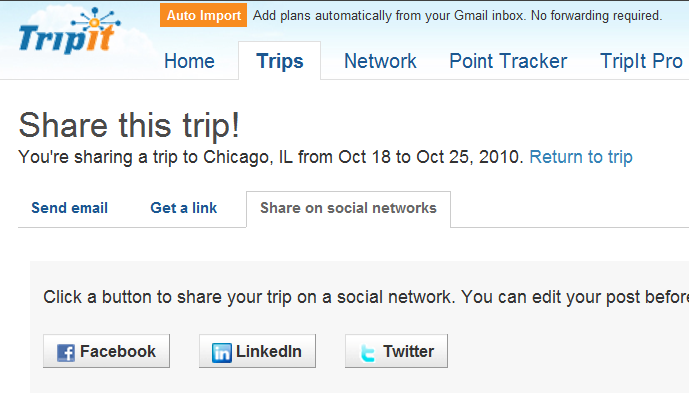
  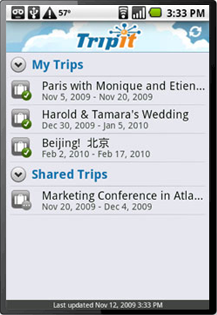
</div>

---

### 1.3 Twitter

**#s2gx 태그**

- 컨퍼런스 공식 사이트에서도 Twitter를 프레임으로 연결
- 참석자들간의 실시간 정보 공유

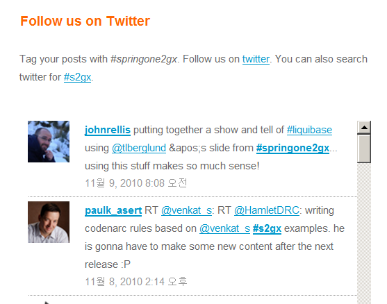

---

### 1.3 Twitter

**나도 하나 올렸더니**

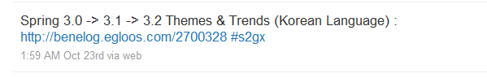

- @dr_pompeii라는 사용자가 나를 follow
  - 올해의 Spring Award – Community Champion 수상자

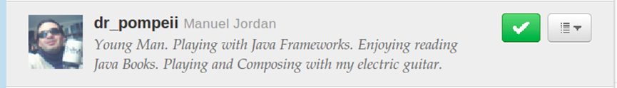

---

### 1.4 Spring Social

**Twitter, Tripit등을 지원하는 스프링 API**

- Twitter에서 친구 목록 가지고 오기

```java
TwitterTemplate tw = new Twitter
List<String> friends = tw.getFriends("sanghyukjung");
```

- TripIt에서 여행 목록 가지고 오기

```java
TripItTemplate ti = new TripItTemplate(...인증키...);
List<Trip> trips = ti.getTrips();
```

- FaceBookTemplate
- LinkedInTemplate

---

### 1.4 Spring Social

**Spring Mobile Android**

- [https://jira.springframework.org/browse/ANDROID](https://jira.springframework.org/browse/ANDROID)

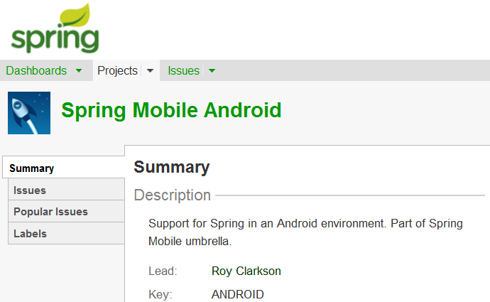

---

### 1.4 Spring Social

**Social Service와 Spring**

- 자연스럽게 사용되고 있는 Social Service
- Spring에서 한두줄의 코드로 바로 연결
- Spring의 지원범위 확장에 대한 예
  - 개발자들이 할만한 반복적인 작업이라면
    - ~Template 클래스

---

### 재미로 만들어 본 NaverTemplate

**네이버 뉴스에서 ‘미역국’ 검색하기 코드**

```java
NaverTemplate naver = new NaverTemplate(API_Key);

SearchCondition cond = new SearchCondition();
cond.setQuery("미역국");
cond.setTarget(SearchCondition.Category.NEWS);
cond.setDisplay(10);
cond.setStart(1);

Channel searched = naver.search(cond);
for(Item page : searched.getItems()){
   System.out.printf("제목: %s \n", page.getTitle());
   System.out.printf("주소: %s \n", page.getLink());
   System.out.printf("설명: %s \n", page.getDescription());
   System.out.println();
}
```

---

### 재미로 만들어 본 NaverTemplate

**dev.naver.com 에서 키 이용 등록**

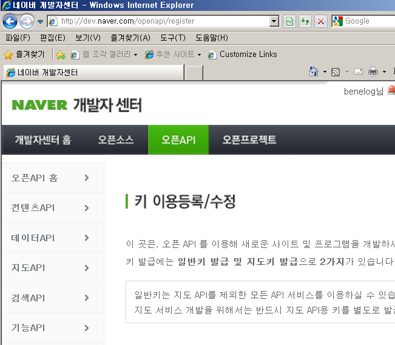

---

### 이미 github에 시작하신 분도...

**Spring-social-korea**

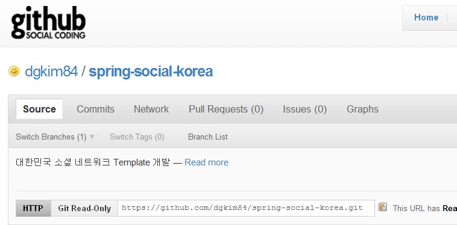

---

## 2. 주요 내용 - 스프링의 다음 발걸음

- 2.1 Keynote
- 2.2 Spring 3.1
- 2.3 Spring과 JavaEE6
- 2.4 분산캐쉬
- 2.5 NoSQL
- 2.6 RabbitMQ
- 2.7 Spring Roo

---

### 2.1 Keynote

**핵심 가치와 제휴 관계 강조**

<div style="display:flex; gap:40px; align-items:flex-start">
<div>

- 다음 10년을 향해
  - Portability
  - Productivity
  - Innovation

</div>
<div>
  
  <p style="font-size:0.7em">이미지는 <a href="http://www.springone2gx.com">http://www.springone2gx.com</a> 에서</p>
</div>
</div>

---

### 2.1 Keynote

**Portability**

- Enterprise의 요구사항을 여러 실행 환경에서
  - Tomcat, Jetty
  - 상용 WAS
  - Google App Engine
  - Amazon EC2 (+ Tomcat)
  - VMForce (+Tomcat)

<div style="display:flex; gap:50px; align-items:center">
  
  
  
</div>

---

### 2.1 Keynote

**Productivity**

- 개발 지원 도구
  - SpringSource Tool Suite (Eclipse plugin)
    - Grails 지원
  - Spring insight
    - Monitoring 도구 : 운영 환경용 곧 제공
  - Spring Roo

---

### 2.1 Keynote

**Innovation**

- Spring Data : NoSql (Not Only SQL) :
  - Neo4j, Redis, MongoDB, Casandra를 더 편하게 쓰는 API
- Spring AMQP, RabbitMQ : Messaging Queue
- Gemfire : Data Grid
- Spring Payment : 지불 API(Visa / Incept5)
- Spring Social
- Spring Mobile
- CodeToCloud : 이슈 관리 + 버전 관리 + CI :

---

### 2.2 Spring 3.1

**기존의 일관성을 지키며 최근 경향 반영**

- Cache Abstraction
- Java 바탕의 설정 강화
- Bean 설정 Profile 개념
- c: namespace
- ConversationMangement

---

### 2.2 Spring 3.1

**Cache Abstraction**

```java
@Cacheable
public Owner loadOwner(int id) {
...
}
@Cacheable(condition="name.length<10")
public Owner loadOwner(String name){
....
}

@CacheEvict
public void deleteOwner(int id){
....
}
```

---

### 2.2 Spring 3.1

**Cache Abstraction**

- Spring Transaction과 유사한 Semantics
  - `<cache:annotation-driven />`
  - CacheManager SPI 제공
- 디폴트는 ConcurrentHashMap
- 기본 구현체 제공
  - EhCache, GemFire, Coherence, GigaSpace
- 80%정도의 전형적인 사용 시나리오 커버 예상

---

### 2.2 Spring 3.1

**Bean profile**

- 환경변수, web.xml 등을 통해 프로파일 지정

```xml
<beans .... profile="dev">
  <bean>...</bean>
</beans>
```

```java
@Service
@Profile("dev")
class UserService{
.....
}
```

---

### 2.2 Spring 3.1

**c: namespace**

- p: 와 동일한 개념이 constructor에도

```xml
<bean class="..." c:age="10/>
<bean class="..." c:family-ref="myFamily/>
```

---

### 2.2 Spring 3.1

**JavaConfig 확장**

- Custom namespace에도 Java config를 쓸 수 있게
  - `<tx:/>`, `<context:/>`, `<util:/>` ...
- 하위 프로젝트들에서 설정 간편화 영향 기대
  - Spring Batch, Spring Security, Spring Integration

---

### 2.2 Spring 3.1

**출시 일정**

- 3.1 M1: 2010년 11월 말
- 3.1 M2: 2011년 1월 초?
- 3.1 RC1 : 2011년 2월말?
- 3.1 GA : 2011년 3월말?
- 3.2 : 2011년 말 경
- 지금까지로 전례로 볼 때 더욱 미루어 질 듯

---

### 2.3 Spring과 Java EE6

**Synergy or Competition?**

- JavaEE6 서버는 Spring의 좋은 실행환경이다
- Spring을 통해 더 많은 선택을 할 수 있다
  - 예)JavaEE5 server + Hibernate 3.6으로 JPA2.0 쓰기
  - Tomcat, Jetty
- 겹치는 부분은 5%도 안된다
  - DI container부분만은 스프링에서 양보할 수 없는 부분인듯

---

### 2.4 분산 캐쉬

**Teracotta BigMemory**

<div style="display:flex; gap:40px; align-items:flex-start">
<div>

- 홍보 데스크, 스폰서 세션
- No GC – Heap 밖의 메모리 공간 사용
  - NIO의 direct buffer 사용 추정
- Java의 메모리모델을 대체하려는 것은 아니다
- EhCache와 사용가능
- Serialize, Deserialize
  - Memcached를 Local로 쓰는 것과 유사?

</div>

</div>

---

### 2.4 분산 캐쉬

**Gemfire**

- SpringSource가 인수한 솔류션
- JP morgan등 Critical곳의 reference
- Data Grid
  - Key-value 저장소
  - Sql Fabric – SQL Cache + Persistence
    - Derby 이용
- 분산 연산 기능
  - Map Reduce도 가능

---

### 2.5 No SQL

**Spring data project**

- 저장소 특성별로 등의 하위 모듈
- Datastore Key-Value
  - Redis
- Datastore Document
  - MongoDB, CouchDB
- Datastore Graph
  - Neo4j
- Datastore Column(Planned)
  - Cassandra, HBase

---

### 2.5 No SQL

**Spring data project**

- 솔류션을 주도하는 업체와 협업으로 진행
  - Hadoop도 예정

<div style="display:flex; gap:40px; align-items:center; flex-wrap:wrap">
  
  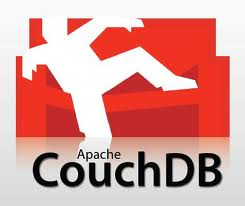
  
  
  
</div>

---

### 2.5 No SQL

**Spring으로 No SQL을 사용하는 여러가지 방법**

- GORM
  - GORM for Redis
  - GORM for Gemfire
- Spring ROO
  - Neo4j Addon
- 상황에 따라 Low-level API와 Warpping API를 선택적으로

---

### 2.6 Rabbit MQ

**Procotol 바탕의 메시징 큐**

- JMS(Java Messaging Server) – Active MQ, Open MQ
  - API 기반의 메시징큐
- Protocol 바탕은 비java와의 Integration이에 장점
- Rabbit MQ는 Erlang으로 만들어짐
  - Multicore에 유리할 가능성

---

### 2.7 Spring Roo

**더 많은 지원 기술**

<div style="display:flex; gap:60px; align-items:flex-start">
<div>

- GWT (Google Web Tools kit)
- GAE (Google App Engine)
- Solr를 위한 인덱싱
  - Lucene 바탕의 검색서버
- Database reverse Engineering
- 향후 Jdbc, iBatis 지원

</div>
<div style="display:flex; flex-direction:column; gap:20px">
  
  
  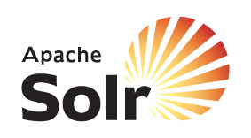
</div>
</div>

---

### 2.7 Spring Roo

**Grails 급으로 격상 시키려 의도가 보임**

- API 샘플 코드의 전파 경로도 될 수 있음

<div style="display:flex; gap:30px; align-items:flex-start">
  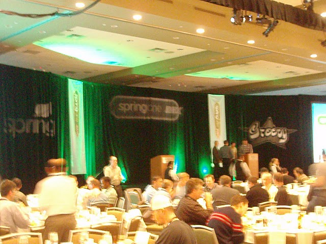
  
</div>

---

## 3. 분석 – 스프링을 둘러싼 전략들

- 3.1 지난 10년
- 3.2 오픈소스 프레임웍 그 이후는?
- 3.3 기술환경 변화
- 3.4 스프링과 PaaS 클라우드
- 3.5 기술 유통 창구

---

### 3.1 지난 10년

**공존(co-located) 아키텍처**

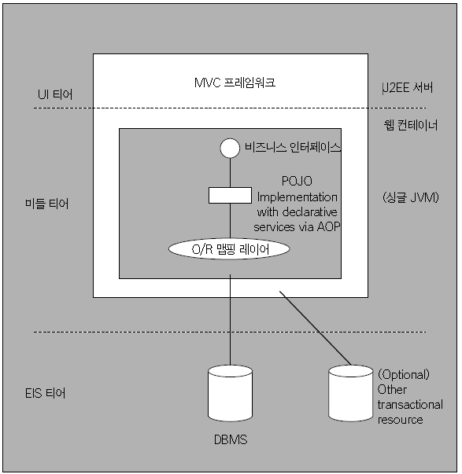

<p style="font-size:0.7em">이미지 출처: 월간마이크로소프트웨어2005년5월,EJB없는 J2EE개발과 오픈소스의 경쟁력</p>

---

### 3.1 지난 10년

**공존(co-located) 아키텍처**

<div style="display:flex; gap:40px; align-items:flex-start">
<div>

- EJB 시절의 통념
  - Web tier와 Business tier의 물리적 분리
  - 더 Scalable 하다는 주장

</div>
<div>
  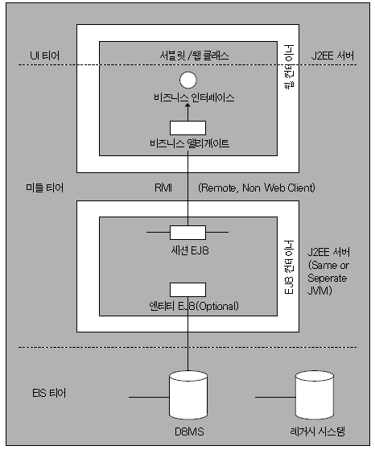
  <p style="font-size:0.7em">이미지 출처: 월간마이크로소프트웨어2005년5월,EJB없는 J2EE개발과 오픈소스의 경쟁력</p>
</div>
</div>

---

### 3.1 지난 10년

**공존(co-located) 아키텍처**

- 로드 존슨의 주장
  - 웹 시스템에서는 Web-tier와 Business tier가 한 machine에 있는 것이 더 효율적이고, 더 쉽게 확장 가능하다
  - 비니지스적 필요성이 있는 부분만 원격호출
    - Proxy를 DI해서 인터페이스 사용
    - 사용하는 쪽에서는 원격인지 아닌지도 신경 쓸 필요 없음
- 최근 EJB 3.1 light
  - 사실상 Spring과 같은 모델인 스펙

---

### 3.1 지난 10년

**스프링 프로그래밍 모델**

- Dependency Injection
  - Singleton, Factory 패턴들과 JNDI lookup의 역할을 한번에
  - 이미 보편적인 프로그래밍 모델
- AOP
  - 핵심 로직에 침범적이지 않은 인프라성 코드
- Portable Service Abstraction
  - 예) PlatformTransactionManager

---

### 3.1 지난 10년

**다른 영역에서의 Dependency Injection**

- Eclipse 4.0

```java
public class ContactView implements IContactView {
  @Inject
  public ContactView(Composite parent) {
```

- RoboGuice (Android)

```java
class RoboWay extends GuiceActivity {
    @InjectView(R.id.name)             TextView name;
    @InjectResource(R.string.app_name) String myName;
    @Inject                            LocationManager loc;

    public void onCreate(Bundle savedInstanceState) {
        super.onCreate(savedInstanceState);
        name.setText( "Hello, " + myName );
    }
}
```

---

### 3.2 오픈소스 프레임웍 그 다음은?

**비니지스 모델을 고민하다**

- 회사 설립, 벤처 캐피탈 투자 받음
- 오프소스 프레임웍만으로는 돈이 안 된다.
  - Tomcat 주도 업체인 Covalent 등 인수
  - 컨설팅,교육이 주 수입원
- 2009년 5천3백억에 VMWare에 인수
  - 100만원짜리 서버 53만대 가격

---

### 3.3 기술 환경 변화

**저장소 분산, 서비스 Integration**

- Social, 대용량 데이터
  - 보다 다양한 기술이 필요하게 되었음
- 저장소 분산
  - 분산 캐쉬, NoSQL 저장소
- Integration
  - Messaging Queue
- 모니터링 도구
  - 많은 수의 서버를 운영하는 환경
- 이런 상황에 맞추어 SpringSource의 인수&제휴 전략

---

### 3.4 스프링과 PaaS 클라우드

**실행 환경에 Portability를 제공하는 Layer**

- Middleware 완충지대
  - WAS에 대한 요구사항이 적음
- OS수준의 가상화 환경에서는
  - 이미 JVM의 portability가 있는데 무슨 이득이?
  - Tomcat (Tc server) + 관리 도구 제공 전략
  - 라이센스, 모니터링, 클러스터링 등의 관리 편의성
- 제약된 JVM + Servlet container
  - Google App Engine
  - GAE에서 JavaEE6 스펙을 지원하기를 기대하기?

---

### 3.4 스프링과 PaaS 클라우드

**Cloud Portability**

- PaaS는 사용자 입장에서 Lock-in의 Risk가 더 큼
- Portability 강조
  - Lock-in 리스크가 작다는 홍보
  - 초기 의사 결정의 장벽 완화
- 같은 이해 관계인 PaaS 사업자와 협업

<div style="display:flex; gap:50px; align-items:center">
  
  
  
</div>

---

### 3.4 스프링과 PaaS 클라우드

**그렇다면 PaaS 제공자의 경쟁력은?**

- 안정성
- 운영 편의성
  - 모니터링 도구
  - 빌드, 배포 등의 작업 편의성
- 가격 정책
- 규모의 경제 + 인프라 기술력이 경쟁력 좌우
  - 구글이 태양광 발전소에 투자?

---

### 3.5 기술 유통 창구

**인터넷 포털과 유사하기도**

- CP(Contents Provider) 데이터를 받아서
- 단일 창구, 일관된 UI로 제공
- CP 업자에게 돈이나 트래픽 제공

<div style="display:flex; gap:30px; align-items:flex-start">
  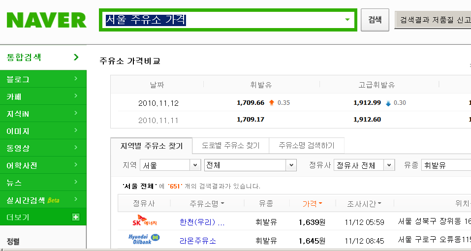
  
</div>

---

### 3.5 기술 유통 창구

**기술 통합 전파 창구**

- 여러 바탕 기술들을
- 일관된 프로그래밍 모델로
  - DI, AOP, 설정 방식 등의 Convention 포함
- Java EE 표준과도 협업 관계
  - 표준보다 넓은 영역, 빠른 피드백 싸이클

<div style="display:flex; gap:30px; align-items:center; flex-wrap:wrap">
  
  
  
  
  
  
  
  
</div>
