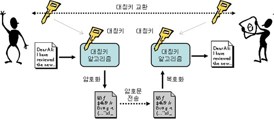

# Open API Business 과정

2011-09-06 ~ 2011-09-07

정상혁

---

### 강사 소개

#### 정상혁

- NHN 생산성혁신랩 과장
- 프로젝트 개발 지원, 개발자 교육
- 한국 스프링사용자 모임(KSUG) 운영진
- 저서 : NHN은 이렇게 한다. 소프트웨어 품질관리 (공저)
- Email : sanghyuk.jung@nhn.com, benelog@gmail.com
- Blog : [http://benelog.egloos.com](http://benelog.egloos.com)
- SNS : [http://me2day.net/benelog](http://me2day.net/benelog)

---

### 강사 소개

#### 나해빈

- NHN 생산성혁신랩 과장
- 생산성 향상 도구 개발/연구, 개발자 교육
- Email : haebin.na@nhn.com
- Blog : [http://haebin.tumblr.com/](http://haebin.tumblr.com/)

---

### NHN 생산성혁신랩

- 내부/외부 개발자 지원 조직
- 프로젝트 기술 지원, 개발 파견, 강의, 개발 지원 도구 개발/리서치, 프랙티스 코칭, 개선
- 네이버개발자 센터, Nforge, Open API 기술 인프라 담당
- We deliver better way!

---

### 전체 목차

#### 1일차 : Open API의 이해와 활용 전략

1. Open API의 개념
2. Open API와 매쉬업 사례
3. Open API와 관련된 스펙(1)
4. Open API와 관련된 스펙(2)
5. 개발자 소통
6. 인증과 보안
7. 운영 이슈

---

### 전체 목차

#### 2일차 : Open API 설계와 구현

1. Open API 설계 원칙
2. 구현 기술의 선택
3. Spring framework 개요
4. Provider 구현 기술
5. Consumer 구현 기술
6. 테스트, 프로젝트 진행 전략과 지원 도구
7. 실습. Consumer 구현사례

---

## 1일차. Open API의 이해와 활용 전략

---

### 1일차 시간 계획

- 1교시 : 09:00 ~ 09:50 : Open API의 개념
- 2교시 : 10:00 ~ 10:50 : Open API와 매쉬업 사례
- 3교시 : 11:00 ~ 11:50 : Open API와 관련된 스펙(1)
- 4교시 : 13:00 ~ 13:50 : Open API와 관련된 스펙(2)
- 5교시 : 14:00 ~ 14:50 : 개발자 소통
- 6교시 : 15:00 ~ 15:50 : 인증과 보안
- 7교시 : 16:00 ~ 16:50 : 운영 이슈

---

### 1교시. Open API의 개념

- 09:00 ~ 09:10 : 강사 소개, 카페 가입 안내, 과정 소개, 참고자료 소개
- 09:10 ~ 09:20 : 수강생 질문, 강의 진행 상의 요구사항 파악
- 09:20 ~ 09:30 : API, Open API 용어의 정리
- 09:30 ~ 09:40 : Open API의 기술흐름상의 의미
- 09:40 ~ 09:50 : Open API의 사업적 의미

---

### 과정 소개

전체 과정에서 전달하고자하는 내용과 목표를 정리합니다.

이 과정은 Open API 기술을 프로젝트 관리자급의 관심사에 초점을 맞춰서 전달합니다.

---

### 과정의 목표

- 오픈 API 기술의 용어를 이해하고, 의사 소통에 활용할 수 있다.
- 조직의 Open API의 활용 전략을 세우고, 해당 전략이 조직에게 주는 이득을 제시할 수 있다.
- 널리 쓰일만한 Open API를 기획하는데 도움이 되는 지식을 익힌다.
- Open API 관련 프로젝트를 진행하면서 위험을 예방하고 생산성을 높일수 있는 정책을 세울 수 있다.
- 다양한 스펙과 구현 기술 사이에서 선택을 할 때 검토 시간을 줄여주는 기초자료를 얻는다.

---

### 질문과 토론

1. Open API하면 떠오르는 구체적인 대상이 있나요?
2. Open API에서 가장 궁금한 점은 무엇인가요?
3. Open API에 대해서 관리자급에서 신경써야할 이슈는 무엇이라고 생각하나요?

---

### 주요 참고 자료

- [Pamela 2011] Developer Community Handbook Documentation
  - 원문 : [http://me2.do/xJ2A7A](http://me2.do/xJ2A7A)
  - 번역문 : [http://me2.do/Fllui0](http://me2.do/Fllui0)
- [오창훈 2009] 오픈API를 이용한 매쉬업 가이드
  - [http://me2.do/Fk8yB4](http://me2.do/Fk8yB4)
- [Raymond 2007] Pro web 2.0 Mashups
  - 원서 : [http://me2.do/GyPrJ7](http://me2.do/GyPrJ7)
  - 번역서 : [http://me2.do/xIP6bn](http://me2.do/xIP6bn)

---

### 주요 참고 자료

- [박지광 2007] 당신은 웹2.0 개발자 입니까
  - [http://me2.do/Fgdcbl](http://me2.do/Fgdcbl)
- [김국현 2010] 웹 2.0 경제학
  - [http://me2.do/5HIM18](http://me2.do/5HIM18)
- [Cal 2006] Building Scalable Web Site
  - 원서 : [http://me2.do/Igr1KO](http://me2.do/Igr1KO)
  - 번역서 : [http://me2.do/GL7JLg](http://me2.do/GL7JLg)

---

### 우리가 생각하는 Open API

Open API의 개념을 설명합니다. Open API의 사전적인 의미와 실무에서 통용되는 범위를 이해합니다.
그리고 Open API가 기술 발전의 흐름에서 어떤 위치를 차지하고 있는지와 사업적으로 어떤 장점과
위험이 있을지 정리하고 관련 사례를 살펴봅니다.

Open API를 개념과 의미를 자신만의 단어를 사용해서 설명할 수 있게 되어서, 상황과 맥락에 따라서
이해당사자에게 잘 설명할 수 있을 정도가 되는 것을 목표로 합니다.

---

### 용어의 정의 : API란?

API = Application Programming Interface

> An application programming interface (API) is a particular set of rules ('code') and specifications
> that software programs can follow to communicate with each other.
>
> ( [http://www.openonweb.com/api](http://www.openonweb.com/api) )

---

### 용어의 정의 : API란?

> An API, or Application Programming Interface, is a set of functions that one computer program makes
> available to other programs so they can talk to it directly. - John Musser
>
> 하나의 프로그램이 다른 프로그램의 접근을 허용해주어 직접 자신과 통신할 수 있도록 해주는 함수의 집합
>
> (번역은 [Raymond 2007]의 번역판 20페이지)

---

### 용어의 정의 : API란?

> API란 개발자가 조종할 수 있는 일종의 조작 체계입니다. 시스템은 자신이 제공할 수 있는 기능을
> 호출가능한 함수로 정리하고, 개발자는 이에 적절한 인자값을 넣어 모듈을 실행하고, 그 결과 값을 받아 갑니다.
>
> \- [김국현 2010] 121페이지

- 소프트웨어가 서로 의사소통을 하는 규약.
- 일반적 의미로는 운영체제, 어플리케이션, 라이브러리 등 다양한 수준의 인터페이스를 총칭
  - Java library, Framework library도 API
- 넓은 의미로는 다른 사람이 쓰는 코드를 개발하는 사람이면 모두 API개발자라도 할 수 있음.
- 문맥에 따라서 API라는 말로도 'Open API'를 지칭하기도 함.

---

### Open API란?

위키페디아의 정의에 따르면 ( [http://en.wikipedia.org/wiki/Open_API](http://en.wikipedia.org/wiki/Open_API) )

> **Open API** (often referred to as OpenAPI new testnology) is a word used to describe sets of
> technologies that enable websites to interact with each other by using REST, SOAP, Javascript
> and other web technologies.

- REST, SOAP, Javascript등을 이용해서 웹사이트를 상호 작용할 수 있게 하는 기술들
- 웹2.0이라는 용어와 동시에 유행
- 누구나 사용할 수 있도록 공개된 API ( [오창훈 2009] )

---

### 기술 흐름상의 의미

현실적 타협으로 보는 시각도 있음.

- 분산 기술, 재활용 기술의 연장선상
  - CORBA, DCOM, RMI, EJB
  - CBD
  - 저장소까지 연결된다.
- Http + 텍스트 기반의 프로토콜
  - 웹UI 기술과 같은 기술요소 공유
  - 사람도 기계도 이해할 수 있는 통신 규약
- Open API를 SOA의 일반 소비자판으로 보는 시각도 있음

---

### 사업적 의미 : 오픈 API의 이득

- 서비스 사용자를 늘인다.
  - Ebay 상품 등록의 50%정도가 API를 통함 ( [오창훈 2009] 35페이지)
- 내부 개발자가 할 작업을 줄여주기도 한다.
  - 프로슈머 (Prosumer) : Producer + Consumer
- 과금 수익
  - 제휴 사용자에게는 요금을 받을수도 있다.

미투데이 App : [http://me2day.net/me2/app](http://me2day.net/me2/app)

---

### 사업적 의미 : 오픈 API의 리스크

- 원래의 서비스에 영향을 미치기도 한다.
  - 예) 과도한 API호출로 DB서버 장애
- 보안 위험성
- 제공자 서비스 불안정성 위험
- 제공자와의 이해 관계 충돌 위험

---

### 리스크 사례 : 오픈 id

- 웹사이트 마다 가입할 필요없이 인증을 대신해주는 Open API
  - 설명 참고 : [http://me2.do/FxImkD](http://me2.do/FxImkD)
- 미투데이에서는 지원 중지
- 서비스 안정성 불안 : [http://itviewpoint.com/183669](http://itviewpoint.com/183669)

"서비스 오픈 때부터 오픈아이디를 지원했었던 미투데이로서도 아쉬운 결정입니다만,
현재 일부 오픈아이디 서비스가 정상 동작되지 않고,
오픈아이디 유저 분들께서도 미투데이 연동 서비스 이용이 원활하게 이루어 지지 않아
부득이하게 오픈아이디 지원을 종료하기로 결정하였습니다."

---

### 리스크 사례 : 플리커

미투데이 플리커 API 사용 사례

- 실제 사용자 데이터가 삭제됨
- "플리커는 왜 미투데이 사진을 지웠나" [http://me2.do/5bWZ4H](http://me2.do/5bWZ4H)
- "미투데이와 플리커, 메쉬업의 문제" http://me2.do/FCvDNc
- "예전에 내 친구의 친구의 기억을 지웠던 플리커 이젠 수많은 사람의 기억을..." : http://me2.do/FRIaV2

---

### 리스크 사례 : 구글 지도 유료화

구글 지도 유료화

- "구글 지도 서비스 유료화 · · · 기업들 `대책 마련 분주`" : [http://me2.do/GeD9p0](http://me2.do/GeD9p0) 참고

Service Level Agreement

- Amazon Service level agreement : [http://aws.amazon.com/s3-sla](http://aws.amazon.com/s3-sla/)

---

### 질문과 토론

1. 과거에 분산 처리나 재활용 기술에 실망한 점이 있다면 공유해주세요

2. Open API의 리스크에서 인용된 뉴스 기사를 보고 느낀 점을 공유하고,

    (1) Consumer일 때 이런 리스크를 예방하기 위한 방안에는 어떤 것이 있을까요?

    (2) Provider일 때 Consumer에게 리스크에 대해 안심 시킬수 있는 방안에는 어떤 것들이 있을까요?

---

### 2교시. Open API와 매쉬업 사례

- 10:00 ~ 10:10 : 질문과 토론
- 10:10 ~ 10:20 : Open API 사례. 국내, 국외 사례 사이트
- 10:20 ~ 10:35 : 매쉬업 개념과 사례
- 10:35 ~ 10:50 : 미투데이와 네이버 API key 받기 실습

Open API 제공자와 매쉬업의 사례를 국내를 중심으로 살펴보고, 제공자나 소비자의 웹사이트가
어떻게 구성되어 있는지 살펴봅니다. 네이버와 미투데이에서 제공되는 API의 명세와 안내사이트가
어떻게 구성되어 있는지 확인하고, 웹브라우저를 통해 간단한 테스트를 해봅니다.
API 제공사이트의 구성과 요구사항을 도출할 수 있게 됩니다.

---

### Open API 제공자 사례

메타 사이트

- [http://www.programmableweb.com/apis](http://www.programmableweb.com/apis)
- [http://www.programmableweb.com/apilist/bycat](http://www.programmableweb.com/apilist/bycat)

공공기관

- 서울시 모바일 공공정보 Open API : [http://mobile.openapi.seoul.go.kr/](http://mobile.openapi.seoul.go.kr/)
- KISTI 학술 정보 : [http://nos.ndsl.kr/index.do](http://nos.ndsl.kr/index.do)

---

### Open API 제공자 사례

쇼핑

- 11번가 : [openapi.11st.co.kr](http://openapi.11st.co.kr/openapi/OpenApiMain.tmall?method=getNoticeBoardList&unityBrdNo=18)
- 옥션 : [http://developer.auction.co.kr/](http://developer.auction.co.kr/)

위키,블로그

- 스프링 노크 : [http://dev.springnote.com/pages/334480](http://dev.springnote.com/pages/334480)
- 이글루스 : [http://apicenter.egloos.com/](http://apicenter.egloos.com/)
- 티스토리 : [http://www.tistory.com/developer/apidoc/](http://www.tistory.com/developer/apidoc/)

---

### Open API 제공자 사례

검색

- Maniadb : (음악, 앨범 정보) [http://www.maniadb.com/api/apispec.asp](http://www.maniadb.com/api/apispec.asp)

SNS, Social

- 네이버, Appfactory : [http://appfactory.naver.com/](http://appfactory.naver.com/)

Storage

- Amazon S3 : [http://aws.amazon.com/s3/](http://aws.amazon.com/s3/)
- Dropbox : [http://www.dropbox.com/developers](http://www.dropbox.com/developers)
- Box.net : [http://developers.box.net/w/page/12923956/ApiOverview](http://developers.box.net/w/page/12923956/ApiOverview)

---

### NHN 참고 사례

네이버 API 확대 제공 방안

- 발표자료 : [http://deview.naver.com/2010/file/D4.pdf](http://deview.naver.com/2010/file/D4.pdf)
- 동영상 : [http://blog.naver.com/deview_con/40114306997](http://blog.naver.com/deview_con/40114306997)

네이버 안의 또다른 세상, 함께 만드는 네이버 소셜앱

- 발표 자료 : [http://deview.naver.com/2010/file/D3.pdf](http://deview.naver.com/2010/file/D3.pdf)
- 동영상 : [http://blog.naver.com/deview_con/40114306969](http://blog.naver.com/deview_con/40114306969)

---

### 매쉬업(Mashup)이란?

- 원래 음악장르에서 나온 용어
  - [http://blastic.tistory.com/130](http://blastic.tistory.com/130) 참조
- Housing map( http://www.housingmaps.com ) 이 최초
  - 부동산정보를 지도에서 ( http://craigslist.com + Google Map)
  - 최초에는 정식 구글 API를 이용하지 않았음
  - 개발자는 Google에 취직

매쉬업 경진대회 출품작

- 2010: [http://mashupkorea.org/112](http://mashupkorea.org/112), [http://mashupkorea.com/2010/voteit](http://mashupkorea.com/2010/voteit)
- 2009 : [http://channy.tistory.com/331](http://channy.tistory.com/331)

---

### 매쉬업 사례

지도 Mashup 사례

- [http://www.mapbuilder.net/Popular.php?OP=ALL](http://www.mapbuilder.net/Popular.php?OP=ALL)
- [http://www.mapbuilder.net/users/tech12/50531](http://www.mapbuilder.net/users/tech12/50531) : 샌프란시스코 살인자
- [http://tutorlinker.com/](http://tutorlinker.com/)
- [http://flashearth.com/](http://flashearth.com/)

책 가격 검색

- [http://www.noranbook.net/](http://www.noranbook.net/)
- [http://www.bookprice.co.kr/](http://www.bookprice.co.kr/)

---

### 매쉬업 사례

yahoo pipe

- "재미있는 유틸 야후파이프(Yahoo Pipes)" : [http://me2.do/GeDuwk](http://me2.do/GeDuwk)
- "Yahoo pipes" : [http://thinknote.tistory.com/13](http://thinknote.tistory.com/13)

통계청 Open API 활용 사례

- "[델파이+Flex]통계청 SGIS OpenAPI 활용 예제" : [http://me2.do/F2xJcR](http://me2.do/F2xJcR)

---

### 실습

네이버와 미투데이 API key 발급 받기 실습

---

### 3교시. Open API와 관련된 스펙(1)

11:00 ~ 11:50

- 11:00 ~ 11:10 : XML, JSON
- 11:10 ~ 11:20 : 스크린 스크래이핑, XML-RPC
- 11:20 ~ 11:30 : SOAP
- 11:30 ~ 11:40 : 피드 포멧 RSS 1.0
- 11:40 ~ 11:50 : RSS 2.0, ATOM

---

### 4교시. Open API와 관련된 스펙(2)

13:00 ~ 13:50

- 13:00 ~ 13:10 : REST 정의
- 13:10 ~ 13:20 : REST 특징
- 13:20 ~ 13:30 : KMS, iCalendar
- 13:30 ~ 13:40 : 마이크로 포멧
- 13:40 ~ 13:50 : 질문과 토론

---

### Open API 관련 스펙

오픈 API에서 사용되는 기술표준과 스펙, 기법에 대해서 살펴봅니다.
많은 기술 스펙이 나온 이유를 이해하도록 합니다.

스펙 중에서 우선적으로 활용하거나 지원할 것들을 선별할 수 있는 정보를 습득해서,
투자효율이 높은 기술전략을 세울 수 있게 합니다.

---

### 스펙 분류

대부분의 프로토콜은 모두 Http 바탕

- 데이터 표기 형식 : HTML, Json, XML
- 구체적인 원격호출 명세 : XML-RPC, SOAP
- 데이터 피딩 포멧 : RSS, ATOM
- 느슨한 설계 원칙, 스타일 : REST
- 특정 데이터 도메인에서 쓰이는 양식 : iCalendar, KMS, 각종 Microformat

[http://xml.coverpages.org/](http://xml.coverpages.org/)

---

### XML

- 데이터 전송량에서는 불리함
- DTD,XML등으로 엄격한 형식 검증에 유리

---

### JSON

- Javascript Object
- 현재는 javascript만의 포멧이 아님.
- XML보다는 전송량에서 유리함
- XML보다는 형식 검증 범위가 작음
  - (기본 validatior : [http://jsonlint.com/](http://jsonlint.com/) )
  - JSON도 스키마를 정의하려는 표준이 논의되고 있다 : [http://json-schema.org/](http://json-schema.org/)

---

### JSON

- formatter & validator
  - [http://www.freeformatter.com/json-formatter.html](http://www.freeformatter.com/json-formatter.html)
  - [http://jsonformatter.curiousconcept.com/](http://jsonformatter.curiousconcept.com/)
- Couchbase, MongoDB는 각종 NoSQL저장소와의 통신에도 쓰임
- javascript의 쓰임새가 server-side에서 확장되고 있어서 앞으로도 유망
  - (참고 : Node.js를 이용한 채팅서버 예제 : [http://dev.paran.com/2011/05/17/nowjs-nodejs/](http://dev.paran.com/2011/05/17/nowjs-nodejs/) )

---

### 스크린 스크래이핑

Http 연결해서 HTML파싱

- 쓰임새
  - Open API 개념이 있기 전부터 쓰이던 기술
  - 요즘도 정식 API가 없는 경우에 어쩔 수 없이 쓰기도함
  - 정식 Open API가 없는 웹사이트와의 연동에 쓰임
- 협의 없이 많이 이루어짐
  - 해킹으로 치부되기도 함
  - 대상 사이트에서 모니터링을 해서 IP blocking을 하기도 함.
  - UI개편이 되면 연동 에러

---

### 스크린 스크래이핑 : 서울버스 사례

- [오래 달궈온 솥, 이제 막 끓기 직전…서울시 공공정보 5월 공개](http://www.bloter.net/archives/30374)
  "다만 서울버스 앱과 같이 HTML 파싱(Parsing)으로 데이터를 긁어가는 것은 보안과 시스템 효율성을 위해서도
  문제가 많은 방식이라며, 오픈 API를 구축해 효율적으로 DB에 접속할 수 있도록 구성해야 한다고 설명했다."
- [데이터 개방 만든 '서울버스'의 딜레마](http://blog.creation.net/492)
  "일간 접속량 제한이 걸린 오픈 API가 열리고, 기존의 서울버스앱이 HTML 스크래핑이 아닌 서버 중계 방식으로
  바뀌게 된다. 즉, 자신이 서버를 직접 운영해야 하는 어려움이 봉착하게 된 것이다."
- [‘서울버스 무료 앱’ 서버관리 부담 덜었다… NHN, 유지비 감당 못한 유주완 씨에 무료 대여](http://news.donga.com/3/all/20110710/38698026/1)
  "포털사이트 ‘네이버’를 운영하는 NHN은 “서울버스 앱을 개발한 유주완 씨에게 기한을 정하지 않고 서버를
  무료로 빌려주기로 했다”고 10일 밝혔다"

---

### REST

- 2000년 Roy Fielding의 박사 학위 논문에서 제안됨.
- 원래는 네트워크상의 설계원칙. Http나 웹에 국한되지않는다.
- Http + json과 xml을 포멧 사용

---

### 피드 포멧

자주 업데이트되는 디지털 콘텐츠를 사용자에게 전송하는데 사용되는 문서 포멧

RSS

- Netscape사에서 뉴스 포멧을 전달하기 위한 목적으로 최초 도입
- Blog, Cafe, SNS , 검색 API에서 대부분 지원
- 웹브라우저, RSS reader사이트 등에서 읽을 수 있음
- 사례
  - [http://en.blog.wordpress.com/](http://en.blog.wordpress.com/)
  - [http://googleblog.blogspot.com/](http://googleblog.blogspot.com/)
- Validation
  - [http://feedvalidator.org/](http://feedvalidator.org/)

---

### RSS 1.0, RSS 2.0, ATOM

RSS 1.0

- Workging group 작업 Netscape사만의 포멧이 아닌

RSS 2.0

- update 필수컬럼 추가
- [http://examples.mashupguide.net/ch04/RSS2.0_Apress_simple_example.xml](http://examples.mashupguide.net/ch04/RSS2.0_Apress_simple_example.xml)

ATOM

---

### XML-RPC

- 스펙정리 : www.xmlrpc.com
- SOAP의 원시형태에 가까움
- 주로 블로그 API에 많이 쓰임.

---

### RSD, 링크백

RSD (Really Simple Discovery)

- 지원하는 API 종류를 알려줌
- [http://en.wikipedia.org/wiki/Really_Simple_Discovery](http://en.wikipedia.org/wiki/Really_Simple_Discovery)
- 예) http://en.blog.wordpress.com/xmlrpc.php?rsd

링크백

- [http://en.wikipedia.org/wiki/Linkback](http://en.wikipedia.org/wiki/Linkback)

---

### SOAP

- Simple Object Access Protocol
- 이제는 Simple.. 의 약자라고 주장하지 않음
- 전문화된 library와 도구 필요
- WSDL : type등에 대한 명세
- 통신 프로토콜로 HTTP를 사용하고 XML을 인코딩하는 방식으로 사용하는 원격 프로시저 호출
- 원격 프로시저 호출이 HTTP 를 통한 XML 문서의 교환으로 변환되는 과정을 추상화.
- 사례
  - [http://geocoder.us/help/](http://geocoder.us/help/)
  - [http://geocoder.us/dist/eg/clients/GeoCoderPHP.wsdl](http://geocoder.us/dist/eg/clients/GeoCoderPHP.wsdl)

---

### 특정 도에인에 특화된 포멧

KML

- 지도 공간에 대한 XML형태 (Keyhole Markup Language)
- code.google.com/apis/kml/documentation/KML_Samples.kml

GEO RSS

- [http://www.georss.org/Main_Page](http://www.georss.org/Main_Page)

---

### 특정 도에인에 특화된 포멧

iCalendar

- 캘린더 데이터읙 효놔에 사용되는 시장 지배적인 표준 : [http://tools.ietf.org/html/rfc2445](http://tools.ietf.org/html/rfc2445)
- upcoming.yahoo.com , eventful.com

Micro-format

- 간단한 공개 데이터 포멧의 집합 : [http://microformats.org/](http://microformats.org/)
- adr, hCard, hCalendar, tag, geo

---

### 질문과 토론

1. 서버 간의 연동방식을 정할 때 약속된 규약이 맞지 않아서 문제가 생긴 경험이 있다면 공유해주세요.

2. 경험해본 각종 연동/연계 솔류션 중에 가장 편했던 것이나 불편했던 것이 어떤 것이고,
그런 과거의 기술과 비교해서 Open API에서 잘 쓰이는 스펙들이 어떻게 보이는지 이야기해봤으면 합니다.

---

### 5교시. 개발자 소통

외부 개발자들의 지원방안을 정리해봅니다.
주로 [http://dna.daum.net/ko/developer-support-handbook/](http://dna.daum.net/ko/developer-support-handbook/) 의 내용을 참조하고,
사례와 개인경험을 덧붙였습니다.

개발자 지원의 중요성

- 사례 : 아마존의 성공은 인도콜센터 때문이다?
  - [http://www.bloter.net/archives/72587](http://www.bloter.net/archives/72587)

---

### 개발자 지원 핸드북 : 문서화

- 클래스 레퍼런스 : API 기능의 포괄적인 목록
  - 도구 예 : [http://code.google.com/p/jsdoc-toolkit/](http://code.google.com/p/jsdoc-toolkit/)
- 변경기록 : 각 API 버전별 변경사항
- 코드 샘플 : 전형적인 API 사용 예제 집합
  - [https://github.com/daumdna/apis](https://github.com/daumdna/apis)

---

### 개발자 지원 핸드북 : 문서화

- 코드 개발터 : API를 사용해보기 위한 대화식 장소
  - [http://code.google.com/apis/ajax/playground/](http://code.google.com/apis/ajax/playground/)
  - [http://mapstraction.appspot.com/](http://mapstraction.appspot.com/)
- 개발자 안내서 : 좌담식으로 쓰여진 API 사용 지침
- 튜토리얼 : API를 사용하는 다른 방법을 논의하는 튜토리얼 또는 스크린캐스트
  - [http://code.google.com/apis/maps/articles/phpsqlajax.html](http://code.google.com/apis/maps/articles/phpsqlajax.html)
  - 외부링크도 수집하라.

---

### 개발자 지원 핸드북 : 포럼 기능

- 이메일 구독 : 만약 여러분이 메일에서 개발자 소통을 원한다면, 메일을 서로 쉽게 나누는 방법이다.
- RSS 피드 : 일상적인 개발자들은 RSS 피드들을 선호할지 모른다. 그들이 필요 할 때 메일 스레드를 열람할 수 있다.
- 스팸 처리 : 공개 포럼들은 스팸에 취약하기 때문에 억제는 필수 요소이다.
- 글쓴이 통계 : 눈에 보이는 통계가 있다면 개발자들은 더 많이 글을 쓰게 된다.
- 뱃지 시스템 : 뱃지시스템은 더 효과적인 참여를 이끌어 낸다.

---

### 개발자 지원 핸드북 : 포스팅 지침

- 답변 가이드를 만들어라
- [http://dna.daum.net/ko/developer-support-handbook/forum.html#id7](http://dna.daum.net/ko/developer-support-handbook/forum.html#id7)

---

### 개발자 지원 핸드북 : 이슈 추적

- 기능 : 댓글ㄹ, 투표, 상태, 중복, 알림, 범주화, 검색, 통계
- 이슈 관리 가이드라인을 만들어라
  - 응답, 필터, 심사회의, 반영

---

### 이슈 추적 도구

- JIRA : 프로젝트 추적으로 사용할 수 있으며 이슈 추적의 모든 기능을 제공한다.
- Github : git 소스 호스트는 각각의 저장소에 대해 간단하지만 거의 모든 기능들을 갖춘 이슈 추적 기능을 포함하고 있다.
- Google Code Project Hosting : 이 코드는 각각의 프로젝트를 위한 이슈 추적을 포함하고 있으며. Github와 유사하지만 더 많은 사용자 정의 및 통계를 포함한다.
- Bugzilla : Mozilla에서 만들어진 오픈소스로 이슈 추적에 모든 기능을 가졌으며 모질라에서 만들어진 제품에 사용되었다.
- Trac : 모든 문제 추적 기능을 포함하고 오픈소스이며 원한다면 Subversion과 연동 할 수 있다.

---

### 개발자 지원 핸드북 : 커뮤니케이션

- 블로그 : 새로운 기능, 중요한 앱, 관련 이벤트와 같이 편하게 받아 들일 수 있는 내용
- 공지 사항 : 주요 버그, 새로운 배포판 안내, 주요 수정 예정사항 등
- Twitter : 문의에 대한 응답, 블로그 글이나 기타 링크 내용을 포함한 트윗, 관련된 리트윗 등
- 토론장 : 공지사항/블로그 글/트위터 등 토론을 필요로 하는 내용들에 대한 재 게시물
- 뉴스레터 : 위에 언급된 내용들을 읽기 쉬운 형태로 요약한 것
  - [http://aws.amazon.com/about-aws/newsletters/](http://aws.amazon.com/about-aws/newsletters/)

---

### 행사 사례

Daum Open API 교육

- DevOnDAum 행사 : [http://daumdna.tistory.com/646](http://daumdna.tistory.com/646)
- Open API 정기 제1회 교육 : [http://daumdna.tistory.com/700](http://daumdna.tistory.com/700)
- Open API 정기 제2회 교육 : [http://daumdna.tistory.com/705](http://daumdna.tistory.com/705)

Google 지도 API

- [http://googlemapsapi.blogspot.com/2008/04/our-first-google-geo-developer-series.html](http://googlemapsapi.blogspot.com/2008/04/our-first-google-geo-developer-series.html)

---

### 행사 요약의 중요성

"이벤트 종료 후 이벤트에서 사용된 발표자료나 동영상 등을 포스팅하는 것이 매우 중요하다.
많은 개발자이 동영상를 보고 발표자료를 넘기며 배우고 싶어한다.
따라서 그들이 보기 쉽도록 교육 자료를 만들어 공유해야 한다.

구글 마운틴 뷰 캠퍼스에서 20명 미만의 지도 개발자을 대상으로 토크 행사를 개최했다.
해당 영상을 녹화한 동영상을 블로그에 올린 후, 이를 다시 모아 정리한 행사 요약 블로그 글 을
게시했는데 그 중 20,000번 정도 재생된 동영상도 있다. 겨우 20명 남짓한 개발자를 대상으로한
이벤트를 개최했는데 1,000배 넘는 사용자에게 까지 내용이 전달되었다니 정말 놀랍지 않은가?"

---

### 개발자로서 느끼는 좋은 행사

- 큰 규모보다는 작은 규모로 자주
- 유료라도 내용만 알차다면야 (5,000원 ~ 10,000원 정도는 낼만하다)
- 이름이 알려진 발표자라면 품질이 보증된다는 느낌..
- 일방적인, 무리한 홍보세션은 없는 것만 못하더라.
- 자기소개나 교류의 장이 있으면 더 좋았음.
- 끝난 뒤 후기,소감이 많아 올라오는 행사.
- 후기를 올리면 상품을 준다고 하는 것도 좋지만, 그것도 보다는 후기를 올릴만한 사람이 흥미를 가진만한
  행사가 되어서 그런 사람이 찾아오게 만들어야 한다.

---

### 6교시. 보안과 인증

Open API provider 개발에서 감안해야 할 보인지침과 암호화, 인증방식에 대해서 알아봅니다.
프로젝트의 보안 기술의 적용 정책수립에 도움이 되는 참고정보를 얻도록 합니다.

---

### 보안지침

일반적인 웹어플리케이션 보안 + alpha

- 웹개발에 필요한 보안 가이드를 따를 것
- SQL Injection
  - http://me2.do/FNN8Op
- 컨텐츠 입력 API에서는 XSS filtering도 중요
  - White list 방식이 바람직
  - Lucy XSS Filter : http://dev.naver.com/projects/lucy-xss
- 구체적인 구현기술이나 미들웨어가 노출되지 않도록한다.
  - 사례1 : Struts2 Security bug
  - 사례2 : Apache 보안 취약점

---

### NHN 사례 참고 자료

단 하루도 안심할수 없게 만드는 웹보안 위험들

- 발표자료 : http://deview.naver.com/2010/file/B4.pdf
- 동영상 : http://blog.naver.com/deview_con/40114281465

통계로 알아보는 DDOS

- 발표자료 : http://deview.naver.com/2010/file/D3.pdf
- 영상 : http://blog.naver.com/deview_con/40114281548

---

### 암호화 기술 개요

암호화 기술을 이해해야 하는 이유

- Open API KEY, oAuth 모두 암호화 기술을 기반으로 함.
- 암호화 처리 방식을 이해해야 oAuth 처리 프로세스를 이해할 수 있음

암호화 시스템의 주요요소

- 암호화 알고리즘
- 암호화 키
- 키 길이

---

### 암호화/복호화란?

- 평문의 메시지를 암호문이라 불리는 안전하게 코드화한 텍스트로 변환 하는 과정
- 이때 사용되는 메시지의 재구성 방법을 암호화 알고리즘이라 함.
- 암호화 알고리즘에서는 Key를 사용함.
- 복호화는 암호화의 역과정으로서, 암호화에 사용된 동일한 알고리즘을 이용하여 본래의 메시지로 환원하는 과정

---

### 대칭키 암호화

암호화 키와 복호화 키가 동일

- 장점 : 암복호화를 위해 하나의 키만 사용, 암호화 및 복호화 속도가 빠름
- 단점 : 키관리의 어려움. 키분배의 문제. 다양한 응용의 어려움
- 알고리즘 : DES, AES, SEED, 3DES, SEA, RC4, Blowfish, IDEA, FEAL



(이미지 출처 : [http://cryptocat.tistory.com/2](http://cryptocat.tistory.com/2) )

---

### 비대칭키 암호화

암호화 키(=공개키)와 복호화 키(=비밀키)와 가 다름

- 장점 : 키관리가 용이. 다양한 응용이 가능. 안전성이 뛰어남
- 단점 : 암호화 및 복호화 속도가 느림
- 사례 : RSA, ECC, KCDSA, ElGamal, DSS 등

---

### 비대칭키 암호화


(그림 출처 : [http://cryptocat.tistory.com/3](http://cryptocat.tistory.com/3) )

---

### 전자서명

- 개인키로 암호화하고 공개키로 복호화 (암호화와 반대)
- 전자문서를 작성한 자의 신원과 전자문서의 변경 여부를 확인할 수 있도록 비대칭 암호화 방식을
- 이용하여 전자서명 생성키(개인키)로 생성한 정보로서 그 전자문서에 고유한 것
- 문서->사전 해쉬값->개인키 암호화->공개키 복호화 -> 사전 해쉬값 -> 사후 해쉬값과 비교

---

### 해쉬 함수

- 특징 : 일방향 함수 + 메시지 압축
- 메시지의 변조(modify)나 원본 메시지의 대체(substitute)를 방지하기 위해 사용
- 전자서명 생성시에 사용
- oAuth 흐름상에서 이 방법을 이용하여 인증 처리함
- 충돌이 일어날 수 있으나, 시간상 비용상 찾아내는 것을 의미없게 하는 것이 목표
- 알고리즘 : MD4(128 bit 결과), MD5(128 bit 결과), SHA(160 bit 결과)
- [http://cryptocat.tistory.com/1](http://cryptocat.tistory.com/1) 참조
- Salt : 임의의 문자를 암호 앞이나 뒤에 넣어서 길이를 길게 함
- Random salt : Salt를 추측하기 어렵도록 Random하게
- iteration : random salt와 hash과정을 반복

---

### HMAC

[http://en.wikipedia.org/wiki/HMAC](http://en.wikipedia.org/wiki/HMAC)

Message Authentication Codes (MAC)

- 개방된 컴퓨팅 및 통신 환경에서 비밀키에 의해 메시지의 무결성(integrity)를 검증하는 방식
- 비밀키를 공유하고 있는 양단에서 송수신한 메시지의 무결성을 검증하기 위한 목적

HMAC = Hashed MAC

- MAC의 방식 중 암호화 기법으로 해시 알고리즘을 이용
- 메시지 인증값(message authentication values)을 계산/검증하기 위해 비밀키를 이용
- 해시 함수 : HMAC-SHA1[SHA-1], HMAC-MD5[MD5], HMAC-RIPEMD[RIPEMD-128/160]
- 작동방식 : 서로 안전하게 나눠가진 비밀키가 있다는 전제조건

---

### HMAC의 목적

- 기존 해시 함수의 특성을 그대로 이용
- 단순한 방식으로 비밀키를 이용
- 해시 함수에 기반한 암호학적 강도 분석이 용이
- 향상된 해시 함수로의 대체 용이

---

### 인증 : Basic 인증

- 예 : [http://www.connotea.org/data](http://www.connotea.org/data)
- Http Header에 값을 넣음
- 평문으로 데이터 전송 : Sniffing 위험성

---

### 인증 : OAuth

- 오픈 OAPI로 개발된 표준 인증 방식
- 비밀번호를 직접쓰지 않는다.
- Consumer 웹사이트에게 Provider 웹사이트 상의 개인 인증 정보를 제공할 필요 없이, Consumer 웹사이트에서
  Provider 웹사이트상의 개인 데이터로의 접근을 허용하는 방법을 제공하는 인증 위임(delegation) 프로토콜
- 실제 사용자의 인증은 Provider 서비스에서 수행하고 Consumer 서비스에게는 사용자 ID와 password가 아닌
  Provider 서비스에서 발급하는 인증 토큰만 제공한다.
  - Consumer는 사용자의 ID, PWD를 알지 못해도 서비스에 접근 가능해짐
- 중간에 중재를 할 수 있어야한다.
- 과정에 속임수가 없다는 것을 인지할 수 있도록 명확한 절차를 제공

---

### OAuth 용어

- 사용자(user) : 서비스 공급자와 소비자를 사용하는 계정을 가지고 있는 개인
- 소비자(consumer) : Open API를 이용하여 개발된 OAuth를 사용하여 서비스 제공자에게 접근하는 웹사이트 또는 애플리케이션
- 서비스 공급자(service provider) : OAuth를 통해 접근을 지원하는 웹 애플리케이션(Open API를 제공하는 서비스)
- 소비자 비밀번호(consumer secret) : 서비스 제공자에서 소비자가 자신임을 인증하기 위한 키
- 요청 토큰(request token) : 소비자가 사용자에게 접근권한을 인증받기 위해 필요한 정보가 담겨있으며 후에 접근 토큰으로 변환된다.
- 접근 토큰(access token) : 인증 후에 사용자가 서비스 제공자가 아닌 소비자를 통해서 보호된 자원에 접근하기 위한 키를 포함한 값.

---

### OAuth 절차

( [http://ko.wikipedia.org/wiki/OAuth](http://ko.wikipedia.org/wiki/OAuth) 참조 )

1. 소비자가 서비스제공자에게 요청토큰을 요청한다.
2. 서비스제공자가 소비자에게 요청토큰을 발급해준다.
3. 소비자가 사용자를 서비스제공자로 이동시킨다. 여기서 사용자 인증이 수행된다.
4. 서비스제공자가 사용자를 소비자로 이동시킨다.
5. 소비자가 접근토큰을 요청한다.
6. 서비스제공자가 접근토큰을 발급한다.
7. 발급된 접근토큰을 이용하여 소비자에서 사용자 정보에 접근한다.

(그림 출처 : [http://www.ibm.com/developerworks/kr/library/wa-oauth1/](http://www.ibm.com/developerworks/kr/library/wa-oauth1/))

---

### 7교시. 운영과 모니터링

운영을 하면서 생길만한 이슈에 대비하는 정책과 중요한 모니터링 항목을 도출 할 수 있다.

전사 차원의 공통 기반 : 공통 관심사 도출

- 인증
- 접근 통제
- 로깅
- 에러 추적을 위한 로그 확인 화면
- 사용 통계
- 자원 모니터링
- 자원 사용 추이 조회
- 이상치 통보 시스템

---

### 모니터링

기존 Web 시스템의 항목 + API 특화항목

- URL별(제공 API별) 사용 통계
- application key별
- 제휴/비제휴 API별 사용량

각종 수치를 보는 목적 주체, 시점을 정의하기

- 항목별로 수집 주기를 정해야만 기술 방안이 나온다
- 실시간, 비동기(메시징 큐), 배치(분산 집계 처리)
- 때로는 성능에 trade-off가 생긴다. (예 APM 솔류션)

---

### 모니터링 항목 정의 예

예) API실행시간 통계

- 보는 주체와 목적 : 개발자들
- 목적 : 튜닝 포인트 찾아내기.
- 구체적 항목 : 평균수행시간, 총수행시간 순위
- 수집방안 : 하루에 한번 Access log를 분석한 결과를 DB에 넣고, 관리화면에서 본다

---

### 점검, 정지 전략

- 예외 상황을 명세에 정의하고 구현, 운영 정책에서 이를 준수한다.
- 일부가 멈추어도 부분적인 기능이라도 동작하도록 한다.
- 정지 점검이 때로는 생길수도 있다
  - DB, OS patch, 저장 구조 최적화, 대용량 index 생성
- 읽기 전용 모드
  - 읽기 API의 요청이 높은 경우가 많다.
  - 쓰기 API만 동작하지 않아도 할 수 있는 작업이 있다.
  - NHN 사례 참조 : Goodbye 점검 공지 - 서비스 중단없는 점검 수행
    - 발표자료 : [http://me2.do/GqEaHg](http://me2.do/GqEaHg)
    - 동영상 : [http://me2.do/xhISs8](http://me2.do/xhISs8)

---

### 장애 예방 활동

능동적인 모니터링 항목 설정

- 자원사용량의 병목지점과 한계치는 어플리케이션 특성에 다른데, 이는 경험적으로 알 수 있다.
- 성능 테스트로 한계치를 '추정'하는 것도 필요함
- 모니터링 수치를 계속 변화시켜 가라
- False alarm을 받는 것이 놓치는 것보다는 훨씬 낫다.

장애예방 정보 공유

- 장애 리뷰 회의
- 장애 원인 파악 보고서
- 신규 투입된 개발자가 반복된 장애를 일으키지 않으려면 필수정보가 정리되어 있어야한다.

---

### 토론 과제 : Open API 리스크

Open API의 리스크에서 인용된 뉴스 기사를 보고 느낀 점을 공유하고,

- Consumer일 때 이런 리스크를 예방하기 위한 방안에는 어떤 것이 있을까요?
- Provider일 때 Consumer에게 리스크에 대해 안심 시킬수 있는 방안에는 어떤 것들이 있을까요?

---

## 2일차. Open API 설계와 구현

---

### 2일차 시간 계획

- 1교시 : 09:00 ~ 09:50 : Open API 설계 원칙
- 2교시 : 10:00 ~ 10:50 : 구현 기술의 선택
- 3교시 : 11:00 ~ 11:50 : Spring framework 개요
- 4교시 : 13:00 ~ 13:50 : Provider 구현 기술
- 5교시 : 14:00 ~ 14:50 : Consumer 구현 기술
- 6교시 : 15:00 ~ 15:50 : 테스트, 프로젝트 진행 전략과 지원 도구
- 7교시 : 16:00 ~ 16:50 : 실습. Consumer 구현사례

---

### 1교시. Open API 설계 원칙

- 09:00 ~ 09:10 : 이름 짓기의 원칙
- 09:10 ~ 09:20 : REST API 설계 원칙
- 09:20 ~ 09:50 : 기존 API명세서 사례 분석

오픈 API설계 원칙의 중요성과 체크포인트를 이해한다.
조잡한 스펙의 API가 배포되어 기업의 기술평판을 해치지 않도록 관리하는 방안을 고민해본다.

---

### Open API 평판

골치거리는? HackersNews에서 한 설문조사 결과 ( [http://daumdna.tistory.com/706](http://daumdna.tistory.com/706) )

- 문서화 미비
- 자주 바뀌는 API
- 인증의 어려움
- 표준의 미비
- SOAP, non-REST
- 바로 써먹을 샘플코드

작은 부분이라도 평판에 영향

---

### 작은 부분이라도 평판에 영향


---

### REST 설계 원칙 : Addressability(주소표현성)

- 모든 리소스는 유일한 URI를 지녀야 함. 리소스의 식별자임.
- URI는 직관적인 단어들을 사용함.
  - /books/orders
- URI는 hierarchical 하도록 구성함.
  - /orders/books/java/20110601
- URI의 상위 경로는 하위 경로의 집합을 의미하는 단어로 구성함.
  - /orders/books/java/20110601 에서 java는 책(book)의 카테고리를 의미함.
- 리소스와 직접 관련이 없는 정보는 Query String으로 처리함
  - /orders?category=books&category2=java&orderdate=20110601

---

### REST 설계 원칙 : Connectedness(연결성)

하나의 리소스는 다른 리소스들에 대한 정보를 포함할 수 있음.

- HATEOS(Hypermedia As The Engine Of Application State)
- 아래 예에서는 Resource Representation 내부에 다른 리소스의 참조(연결) 정보가 포함되어 있음.

```xml
<order self="http://bookstore.com/orders/books/java/20110601_0001000">
  <amount>23</amount>
  <book ref="http://bookstore.com/books/A03856743" />
  <customer ref="http://bookstore.com/customers/124" />
</order>
```

---

### REST 설계 원칙 : Statelessness(상태없음)

- 상태를 유지하지 않음 세션, 쿠키 사용(X)
- URI에 현재 State를 표현할 것을 권장함.
  - http://...... /order/A3024?apikey=a12847bddhwjf

---

### REST 설계 원칙 : Homogeneous Interface(동종 인터페이스)

HTTP에서 제공하는 기본적인 4가지의 method를 사용함

- 리소스 조회 : GET
- 새로운 리소스 추가 : POST
- 존재하는 리소스 변경 : PUT
- 존재하는 리소스 삭제 : DELETE

---

### REST 설계 원칙 : Content Negotiation(컨텐트 협상)

- 요청 정보에 Accept Header를 추가하여 리소스의 원하는 Representation 형태를 지정함.
- 동일한 URI라도 Accept Header가 달라지면 응답의 Representation이 변경됨
  - 요청 URI : /orders/A3024
  - Accept: application/xml → XML 응답
  - Accept: application/json → JSON 응답
- URI에 확장자로 Content Negotiation를 대신하는 경우가 있음.
  - 예) Twitter API
  - 일반적인 브라우저는 Accept Header를 고정하여 사용하는 경우가 있기 때문
  - /orders/A3024.xml → XML 응답
  - /orders/A3024.json → JSON 응답

---

### 이름 짓기의 원칙

- 문서 없이도 API의 기능이 직관적으로 들어올 수 있는 이름
- 좋은 이름은 좋은 개발을 이끔
- 이름 짓기 힘들다면 좋지 않은 설계의 징후
- 쓰는 사람의 입장에서
- 전체 API에 걸쳐서 일관성이 있게

---

### 좋은 이름의 조건

- 발음하기 쉬운/검색하기 쉬운 이름
- 문제 지향성(Problem orientation)
- '어떻게'보다 '무엇'을 표현
- 역할과 의도 제시
- 의도 제시형 이름
- 세부 구현에 의존적이지 않게
  - Customer.linearCustomerSearch -> Customer.find

---

### 이름 짓기 : 참고할만한 자료

일반적인 이름짓기의 원칙이 Open API에도 유효하다

- Code Completed 2nd Edtion
  - Ch 6.2 클래스의 이름
  - Ch 7.3 루틴의 이름
  - Ch 11 변수 이름의효과
- 켄트백의 구현패턴
  - 101페이지 , 128페이지 , 53페이지
- Clean code
  - 2장 : 의미 있는 이름

---

### API 설계 정책

- 이미 있는 API와 검토하고, 유사하게 만들어라
  - 예) www.23hq.com에서는 Flickr를 따라했고, Client 모듈을 만드는 진영에서 금방 지원해줬다
- 스스로 Consumer를 먼저 만들어보아라
  - 배포 전에 소비자의 입장에서 생각해보고 먼저 개선한다.
- 소수의 설계자 혹은 최종 승인자를 정해라.
  - 일관성 있는 설계는 소수에게서 나온다.

---

### API 설계 정책

'개념적 무결성을 이루려면 시스템에 하나의 철학이 반영되고, 사용자 입자에서 본 명세는 소수의 두뇌가
고안한 것이어야한다.' - 맨먼스미신 한글판 76페이지

- 버전 체계를 세워라
  - 버전에 따른 URL 체계
  - API 버전정보 제공 사례 : [http://aws.amazon.com/archives](http://aws.amazon.com/archives)

---

### 실습. Open API 명세 평가해보기

- [http://openapi.11st.co.kr/openapi/OpenApiSearch.tmall](http://openapi.11st.co.kr/openapi/OpenApiSearch.tmall)
- [http://developer.auction.co.kr/Information.aspx?menu=sub5](http://developer.auction.co.kr/Information.aspx?menu=sub5)

---

### 2교시. 구현 기술의 선택

- 10:00 ~ 10:10 : 언어의 선택
- 10:10 ~ 10:20 : Open 소스 활용 정책
- 10:20 ~ 10:50 : 프레임웍

---

### 언어의 선택 : 왜 아직도 java?

- 아직까지도 가장 많이 쓰이는 언어
  - [http://www.tiobe.com/content/paperinfo/tpci/index.html](http://www.tiobe.com/content/paperinfo/tpci/index.html)
- 많은 오픈소스 라이브러리, 도구
- Compile time validation
- 성능, 편의성 등에서 적절한 중간
- JVM위의 언어들
  - Scala, Clojure
  - JRuby, Jython

---

### 언어의 선택 : PHP

- 웹생태계의 많은 비중을 차지하는 LAMP의 일부 (Linux + Apache + Mysql + PHP)
- 호스팅 업체 많음
- 오픈소스 히트작이 많음 : Zeroboard (XE), Wordpresss, Drupal
- Consumer의 많은 비중이 될 것이라는 것을 염두에 두어야함

---

### 언어의 선택 : Ruby

- 몇년전 웹2.0 열풍과 함께 급부상
- 클라우스 호스팅에서도 많이 지원
  - [http://www.heroku.com/](http://www.heroku.com/)
  - [http://www.engineyard.com/](http://www.engineyard.com/)
  - [http://www.cloudfoundry.com/](http://www.cloudfoundry.com/)
- Ruby On Rails : Twitter, 미투데이. 웹개발 통합 프레임웍, 종합선물세트
- Backend 성능에서는 불만족스러운 경우가 많음
  - [http://www.infoq.com/articles/twitter-java-use](http://www.infoq.com/articles/twitter-java-use)

---

### 언어의 선택 : Javascript

- UI요소로서는 피할 수 없는 선택
- 보통 API key등을 직접호출하지는 않음
  - 검색, 글쓰기 API에서는 직접적인 Consumer는 아님
- 지도 API의 consumer에서는 높은 비중
- Jquery의 천하통일 분위기
- Mobile UI 이슈

---

### 언어의 선택

- Provider의 구현 기술로 Java가 무난
- Consumer로서 다양한 언어를 다 염두에 두고
  - 해당 언어의 관습을 염두에 둔 가이드
  - 라이브러리 추천
  - 샘플코드 제공

---

### 개발자 소양

- Provider 기술에 대한 깊은 경험
  - 웹개발 기술 + alpha
  - 오픈소스 프레임웍, 미들웨어 활용능력
    - Web tier : Spring MVC, Struts, Servlet Spec
    - Persistence Framework : iBatis, anyFrame queryservice
- Consumer 기술의 폭넓은 이해
  - 다양한 언어의 특성을 이해
  - 특히 Javascript와 Ajax
- API설계 능력,경험
  - 굳이 Open API나 웹 API가 아니더라도

---

### 면접 질문 예시

- 스스로 생각하는 Java 언어의 장점은?
- Spring framework을 왜 쓴다고 생각하나?
- JDBC API spec에서 가장 문제점은?
- Script 언어 중에서 가장 선호하는 언어와 그 이유는?

---

### 기업전략으로서의 Open source

- 오픈소스 개발자는 백수가 아니다.
  - 예) IBM이 독자 OS개발대신 리눅스 커뮤니티에 참여하여 연간 10억달러 절약 추산
  - (돈 텝스코드, 앤서니, 위키노믹스. 21세기북스. 2007)
- 오픈소스 사업 모델
  - 컨설팅 + 기술지원
  - Enterprise Tomcat expert : [http://www.tomcatexpert.com/](http://www.tomcatexpert.com/)
  - Pizza-hut migration 사례

---

### 오픈소스의 리스크

- 기술 지원
- 패치가 늦게되는 경우
  - Struts2보안 bug 패치 사례
    - 2010년 5월31일날 보고 했다. : [http://securityreason.com/exploitalert/8435](http://securityreason.com/exploitalert/8435)
    - 2010년 6월 20일날 소스 고침 : [http://svn.apache.org/viewvc?view=revision&revision=956389](http://svn.apache.org/viewvc?view=revision&revision=956389)
    - 2010년 8월16일에 release된 2.2.1에 포함

---

### 오픈소스의 리스크

- 망하기도 함
  - [http://www.opensymphony.com/](http://www.opensymphony.com/)
- 리스크 상쇄 방안
  - 전문 인력과 지원 조직 양성
  - 라이브러리 관리 체계

---

### 오픈소스 활용 체크리스트

프로젝트에서 사용하는 jar파일의 리스트

- 버전을 다 파악하고 있는가?
- 왜 그 버전을 썼는지 이유가 있는가?
- 각 library간의 dependency는?
- Maven을 사용하면 유리

---

### 오픈소스 활용 체크리스트

- 오픈소스 프로젝트별 평가
  - 최근까지 update되고 있는 프로젝트인가?
  - Documentation
  - Community 활성화 정도
  - 실무 적용 레퍼런스
- 신규소식을 받아보는 채널이 있는가? (Mailing list, forum)
- 핵심 관리 대상이 지정되어 있는가?
  - DB connection, Network 통신 library
  - upgrade 정책 차등

---

### 3교시. Spring framework 개요

- Spring과 JavaEE 표준 : [http://benelog.egloos.com/2703581](http://benelog.egloos.com/2703581)
- Spring과 Cloud : [http://benelog.egloos.com/2765024](http://benelog.egloos.com/2765024)

자료 : [spring-summary.pdf](./035-spring-summary.pdf)

---

### 4교시. Provider 구현

Open API Provider 기술의 장단점을 이해하고, 프로젝트 적용할 때 이슈로 관리해야할 포인트를 집어낼 수 있다

구현 기술 경향

- Annotation 활용
  - Spring과 JAX-RS구현체 모두 비슷한 프로그래밍모델을 가지고 있음
- 경량 Container 활용
  - JAX-RS 구현체를 쓰더라도 container로 Spring 사용가능

---

### Spring framework

Spring MVC의 REST 지원 기능을 Open API개발에 사용 가능

- @PathVariable 등 REST에 적합한 Annotation 지원
- JSR 표준은 아님
- HTML페이지와 xml,json을 동시에 제공할 때 유리
  - Content negotiation

---

### JAX-RS와 SpringMVC의 REST지원의 관계

[http://benelog.egloos.com/2703581](http://benelog.egloos.com/2703581)

"스프링 3.0에서도 Spring web MVC에서 나름대로의 스펙을 가진 REST지원 기능이 있습니다.
사실 위의 @Path와 @PathParam 은 스프링의 @RequestMapping, @RequsetParams 아노테이션과
무척 유사해보이는, 비슷한 프로그래밍 모델을 가지고 있습니다.
왜 스프링개발자들이 Spring MVC에서 JAX-RS를 바로 지원 안하고 나름대로의 스펙을 만들었는지에
대해서는, 스프링소스의 팀 블로그를 통해서 밝힌 적이 있습니다.

기존의 JAX-RS 스펙을 바로 지원하는 것도 프로토타이핑해봤지만, 자연스럽게 않게 억지로 끼워 맞추는
듯한 방식이 나왔고, 결국 Spring MVC사용자들에게 더 일관적이고 편한 방식을 제공하는 나름대로의
기능을 넣기로 결정했다는 것이였습니다."

---

### JAX-RS와 SpringMVC의 REST지원의 관계

"이날 발표에서도 유겐할러는 Spring MVC는 근본적으로 MVC구조라서 View의 rendering을 하는 부분을
분리할 수 밖에 없고, 따라서 JAX-RS 방식과 달라질 수 밖에 없다고 했습니다.
그리고 Jersey, RESTEasy, Restlet와 같은 JAX-RS 구현체를 쓴다고 해도 Spring를 같이 쓸 수 있으니,
상황에 따라서 Spring MVC의 REST 기능이나 JAX-RS 구현체를 모두 골라서 쓸 수 있다고 했습니다.
UI페이지와 REST요청을 같이 처리해야하는 어플리케이션에서는 Spring MVC로, 계층적인 리소스 구조처럼
REST 방식을 깊이까지 쓰는 어플리케이션이라면 JAX-RS 구현체를 쓰는 것처럼 말이죠.
스프링은 언제나 그래왔듯이 선택에 대한 것이라는 말을 덧붙였습니다.
(Spring is (and always was) about choice)"

---

### JAX-RS

```java
@Path("widgets")
public class WidgetsResource {
   @Autowired
   private WidgetsService service;

   @GET  @Path("{id}")  @Produces("text/html")
   public String getWidget(@PathParam("id") int id) { ... }
}
```

Java API for RESTful Web Service

---

### JAX-RS, JAX-WS 구현체

Apache CXF

- OpenSource WebServices Framework
- JAX-WS ,JAX-RS 지원
- [http://www.ibm.com/developerworks/kr/series/ws-pojo-springcxf.html](http://www.ibm.com/developerworks/kr/series/ws-pojo-springcxf.html)

JBoss RESTEasy

- JAX-RS지원
- Asynchronous HTTP(Server-Side Pushing) COMET
- Embedded Container와 JUnit을 이용한 단위 테스트 지원
- GZIP Compression, Server-Side Caching, Browser Cache

---

### JAX-RS, JAX-WS 구현체

Restlet

- [http://www.restlet.org/](http://www.restlet.org/)
- JAX-RS 지원, Servlet기반 경량 프레임웍

Jersey

- [https://jersey.dev.java.net/](https://jersey.dev.java.net/)
- Sun Glassfish에 탑재
- [[REST] jersey로 REST구현하기](http://blog.openframework.or.kr/73)
- [[REST] Jersey로 xml과 json데이터를 추출하기](http://blog.openframework.or.kr/67)
- [Jersey and Spring](http://blogs.sun.com/enterprisetechtips/entry/jersey_and_spring)

---

### JAX-RS, JAX-WS 구현체

Metro

- [https://metro.dev.java.net/](https://metro.dev.java.net/)
- JAX-WS 구현체

Wink

- [http://incubator.apache.org/wink/](http://incubator.apache.org/wink/)
- REST- Server와 Client를 같이 제공

---

### Scalability

- Stateless하면 Scalable하다.
  - 수평확장이 쉽다.
- Statful한 부분을 인식한다. (대부분 각종 저장소)
  - DB (Persistent repository)
    - 가장 비싸고, 확장하기 어렵다.
  - Global Cache
  - Clustered Session Repository

---

### Scalability

- 가능한 많은 역할을 Stateless한 구성요소에서
  - 로직을 DB보다는 WAS로
- Stateful한 구성요소끼리도 역할분담이 쉬운 구조로 개발하기
  - 예) Join이 많은 쿼리는 Cache하기가 까다롭다.

---

### 이슈 관리

- XML, JSON등 다양한 포멧을 제공하는데 소스 중복이 얼마나 있는가?
- 향후 다른 기술로 대체해야한다면 소스의 수정 비용이 큰가?
- 데이터가 늘어난다면 소스 수준에서 수정할 곳이 얼마나 있는가?

참고자료

- Cache : 발표자료([http://deview.naver.com/2010/file/B3.pdf](http://deview.naver.com/2010/file/B3.pdf)), 동영상([http://blog.naver.com/deview_con/40114281320](http://blog.naver.com/deview_con/40114281320))

---

### 5교시. Consumer 구현

Library - Java

- HttpUrlConnection
- Apache Commons HttpClient
- Spring RestTemplate
  - Wrapper로 HttpUrlConnection과 Apache HttpClient를 다 사용가능
- Wink Rest Client
  - [https://cwiki.apache.org/WINK/61-getting-started-with-apache-wink-client.html](https://cwiki.apache.org/WINK/61-getting-started-with-apache-wink-client.html)

Library - javascript

- Jquery

---

### Consumer 구현 : Api client 사례

Cross Domain 해결 방법

Api client 사례

- 지도 : 네이버, 다음, 구글
- Twitter
- Facebook

---

### 6교시. 테스트

open API의 테스트에 쓸만한 기법과 기술들을 알아보고 이를 통해 프로젝트의 위험성을
조기에 예방하는 정책을 세우는데 참고합니다.

기능 검증 : API 형식 검증

- API 따르는 명세의 형식 검증 도구를 이용하라
- XML이나 Json을 String출력으로 수동으로 만들었다면 형식을 맞추는데서도 에러가 많이 발생한다.
- 예) RSS 형식 검증기 : http://feed2.w3.org/check.cgi

---

### 테스트 자동화

- API 테스트 자동화는 충분한 ROI가 나온다
  - UI 테스트 자동화보다는 훨씬 쉽다.
  - UI테스트는 깨어지기 쉽고, UI 기술 등에 대해서 알아야 할 지식이 많다.
- API테스트 코드는 API client코드 그 자체다.
- 프로젝트 초기부터 테스트 자동화를 해라.
  - 나중에 하면 더 어렵고, 시간이 없다.
  - 설계 개선을 더 빠른 시점에

---

### 테스트 자동화 : 도구

- Continous Integration : [http://ci.jenkins-ci.org/](http://ci.jenkins-ci.org/)
- Junit
- Finess Rest Fixture : [http://smartrics.blogspot.com/2008/08/get-fitnesse-with-some-rest.html](http://smartrics.blogspot.com/2008/08/get-fitnesse-with-some-rest.html)

---

### Hudson 활용사례와 Cloud 개발환경

각종 Hudson 활용사례

- [http://wiki.hudson-ci.org/display/HUDSON/Amazon+EC2+Plugin](http://wiki.hudson-ci.org/display/HUDSON/Amazon+EC2+Plugin)
- [http://wiki.hudson-ci.org/display/HUDSON/Hadoop+Plugin](http://wiki.hudson-ci.org/display/HUDSON/Hadoop+Plugin)
- [http://wiki.hudson-ci.org/display/HUDSON/Grinder+Plugin](http://wiki.hudson-ci.org/display/HUDSON/Grinder+Plugin)

Java PaaS & Cloud 개발환경

- [http://www.cloudbees.com/platform-overview.cb](http://www.cloudbees.com/platform-overview.cb)

---

### 성능 테스트

- API 성능은 민감하다.
- mobile device 등은 안 그래도 느리다.
- Consumer가 일반 소비자가 아닌 기술자들이라 더 빨리 반응하고, 적극적을 대응한다.
- API는 상대적으로 더 많은 layer를 타게 되어서 불리하다.
  - 그런데도 개발자는 DB에 바로 접근하는 것과 비교하기도 한다.
- Consumer가 성능이 안 나온다고 주장할 때 구체적인 자료를 제시할 수 있어야한다.
- 조기에 검증한다.
  - 뒤늦게 발견되었는데 전체 구조를 고치기는 힘들다.

---

### 성능 테스트 : 도구

- Grinder ( http://grinder.sourceforge.net/ )

참고 : NHN의 테스트 자동화

- [http://deview.naver.com/2010/file/A2.pdf](http://deview.naver.com/2010/file/A2.pdf)
- [http://deview.naver.com/2010/file/A1.pdf](http://deview.naver.com/2010/file/A1.pdf)

---

### 7교시. 실습. Consumer 구현사례

Daum 지도 API 실습

- 예제 파일 : [daummappractice.html](./036-daummappractice.html)

네이버 API 실습

- 예제 파일 : [naverapisample2.html](./037-naverapisample2.html)

---

### 실습. Local에서 WAS 실행

1. 첨부 파일을 특정 디렉토리로 다운 받기
2. 샘플예제도 같은 디렉토리에 복사
3. cmd로 빠져나가서 winstone.jar가 있는 디렉토리로 간다.
4. 아래 명령 실행

```
java -jar winstone.jar --webroot=.
```

5. 웹브라우저에서 아래 URL열기

```
localhost:8080/샘플파일명.html
```

파일 : [winstone.jar](./037-winstone.jar)

---

## 부록

---

### 보조 자료

오픈 API 제공자 사례

- [http://www.openonweb.com/api](http://www.openonweb.com/api)
- [http://dna.daum.net/ko/developer-support-handbook/appendix.html](http://dna.daum.net/ko/developer-support-handbook/appendix.html)

Open API 개발자 커뮤니티

- 네이버 : [http://cafe.naver.com/ndevcenter.cafe](http://cafe.naver.com/ndevcenter.cafe)

---

### 보조 자료

URL 정책 사례

- [http://benelog.springnote.com/pages/1369234](http://benelog.springnote.com/pages/1369234)
- .xml , .json

Open API 교육, 세미나 관련 자료

- NHN 비트 컴퓨터와 협약 : [http://news.naver.com/main/read.nhn?mode=LSD&mid=sec&sid1=105&oid=029&aid=0002080491](http://news.naver.com/main/read.nhn?mode=LSD&mid=sec&sid1=105&oid=029&aid=0002080491)

---

### 기술 평판 사례

클라우드 비교

- [projectresearch.co.kr : Mac에서 Dropbox, ucloud, Daum 클라우드, N 드라이브 사용 환경 비교](http://projectresearch.co.kr/2011/03/06/mac%EC%97%90%EC%84%9C-dropbox-ucloud-daum-%ED%81%B4%EB%9D%BC%EC%9A%B0%EB%93%9C-n-%EB%93%9C%EB%9D%BC%EC%9D%B4%EB%B8%8C-%EC%82%AC%EC%9A%A9-%ED%99%98%EA%B2%BD-%EB%B9%84%EA%B5%90/)

사이트 사용성 평판 사례

- [http://me2day.net/cobratop/2011/09/05](http://me2day.net/cobratop/2011/09/05)

모바일앱 평판 사례

- [http://www.androidzoom.com/android_applications/productivity/ucloud-mobile_kqur.html](http://www.androidzoom.com/android_applications/productivity/ucloud-mobile_kqur.html)

---

### 개발자 잉여 포스

"독일 프랑크푸르트의 한 똑똑한 해커가 아이팟 운영체제를 역 엔지니어링하여 리눅스를 이식한 사례는
그 자체로 놀라운 이야기이다. 이 프로그램이 탄생하기까지 그는 4개월동안 뼈를 깎는 노력을 하고,
소프트웨어 코드의 수많은 라인을 일일히 분석했다고 한다."

\- 위키노믹스 5장 원주 8

"예를 들어 리누스 토발즈에게 왜 프로그래머들이 자기 인생의 많은 부분을 바쳐 직접적으로 금전적
보상을 받을 수도 없는 리눅스 개발에 몰두하느냐고 물었더니 그는 이렇게 대답했다.
'당신이 소프트웨어 기술자라면 그런 질문을 하지 않을 것입니다. 그들은 어떤 기술적인 문제를 해결하면
목 뒤의 털이 쭈뼛 설 정도로 환상적인 기분을 느낍니다. 저 역시 그런 기분 때문에 이 일을 합니다."

---

### Q&A. 인증관련 질문

1. HMAC은 최초로 비밀키를 교환할 때 어떻게 쓰는가?

2. OAuth에서 Access_key를 암호화하는가? 키가 노출되었을 때 위험성은 없는가?

3. OAuth에서 최초에 request_token을 사용하는 이유는 무엇인가?

---

### Q&A. OAuth 키 노출의 위험성

"access_token 가 노출되는 것은 실수가 아닌이상 노출은 쉽지 않습니다. 만약 내부 정보 노출로 인하여
access_token가 노출되었다 하더라도 access_token만 노출되면 위험성은 없습니다.
왜냐하면 provider는 access_token 뿐만 아니라 access_secret 값도 발급합니다.

access_secret값은 암호화하는데 사용하는 값이고 request 요청에 포함되지 않습니다.
즉 access_token만 노출되었다 하더라도 provider의 자원에 접근하려면 암호화된 singnature 값을
전달해야 하는데 access_secret값이 없으면 valide한 singnature값을 만들 수 없기 때문입니다.

만약 access_token값과 access_secret값이 모두 노출되었다고 하면 이는 사용자의 아이디와 패스워드가
노출되었다는 것과 같은 의미입니다. 당연히 위험한 것이지요...
그런데 oauth에서는 개인 유저가 특정 consumer에서 provider를 접근하는 것을 해제할 수 있습니다.

---

### Q&A. OAuth 키 노출의 위험성

"만약 개인 유저가 특정 consumer의 provider 접근을 못하게 해제했다면 access_token와 access_secret 값이
노출되었다 하더라도 자원에 접근을 할 수가 없습니다.

참고로... access_key값은 request을 보내는 signature에 포함이 되지만 이는 암호화되어 포함된 것이라
일반적으로 노출되지 않습니다"

---

### 카페

[https://cafe.naver.com/openapibiz](https://cafe.naver.com/openapibiz)
