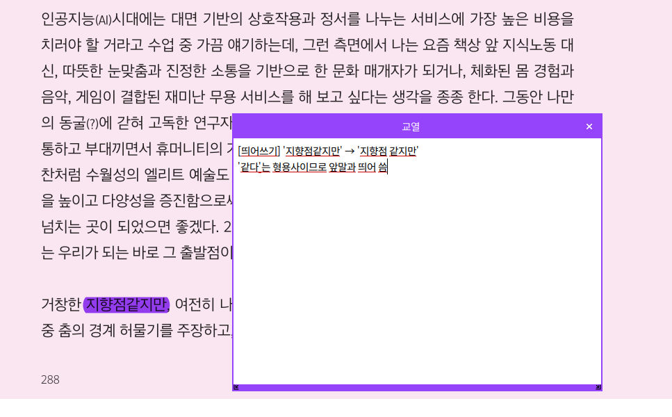

# AI agent에게 개인적인 일 시키기

2026-04-26
정상혁

---

## 배경 지식

---

### AI 채팅 서비스 vs AI Agent

---

### 핵심 메시지

* AI Agent는 질문에 답하는 AI에 그치지 않음
* 내 컴퓨터와 외부 서비스를 다루며 일을 진행
* 사람은 목표 설정, 중간 확인, 최종 판단에 집중
* 반복되는 귀찮은 일을 조금씩 넘기는 방식이 현실적

---

### LLM Engine
* 3대장
    * OpenAI GPT 계열
    * Claude 계열
    * Gemini 계열
* 가성비/경량 모델
    * Qwen 등

---

### AI Agent 도구
* Claude Code (Anthropic)
* Codex (OpenAI)
* OpenHands 등 오픈소스 도구
* Hermes (오픈소스)
* 기타 아주 많음
* AI Agent 도구 간에 서로 호출하기도 함

---

### 연관된 기술 생태계
* Markdown : HTML을 간결하게 표현하는 형식
    * 이 발표자료도 [Markdown으로 작성](https://github.com/benelog/presentations/blob/main/20260426-ai-gent/slides.md)
* Git, GitHub : 버전 관리 도구
* 스크립트 언어 : Python, JavaScript (Node.js)
* 패키지 관리자 : 프로그램 설치 도구
    * Brew (macOS)
    * npm : JavaScript 실행 환경인 Node.js의 패키지 관리 도구

---

### 어디에 쓰나?

#### 회사 일
* 거의 모든 일
    * 코딩, 문서 작성
    * 데이터 분석
    * 프로젝트 / 할 일 현황 파악, 관리
    * 이메일 작성 (특히 영어로)

---

#### 개인적인 일
* 개인 자료 관리
    * 수집, 분류, 글쓰기, 사이트 배포
* 동호회(?) 활동
    * 산출물 취합, 검사, 리포트
    * 모임 통장 관리

---

## 사용 사례

---

### 웹 페이지 퍼블리싱
* 시작 프롬프트
    * 이북의 URL을 여러 개 전달하고 해당 이북들을 책 가판대처럼 배치해서 링크로 연결하는 사이트를 만들어 달라고 함
* 결과물 : https://yonsei.surge.sh/

---

### 모임 통장 입금 내역 관리
전체 과정을 자동화 : [작업 계획서 모음](https://github.com/benelog/yonsei-donations)

* 신한은행에서 3개 모임 통장의 입금 내역을 HTML로 다운로드
* [입금 내역을 Google Drive](https://drive.google.com/drive/folders/1DykuZXX3ULgCG3mi4ika-gjRZlakoAMb?ths=true)로 업로드
    * [학교에 제출할 양식](https://docs.google.com/spreadsheets/d/1HYHYYUM63zIdSpKjFrc94khtau-0FYUFOgd-u_pdvyY/edit?gid=374073609#gid=374073609)으로 변환 ( + 학번 자동 입력)
    * 몇 반인지 분류 : ['정상혁(8반)' 형식으로 넣어달라고 공지](https://yonsei.benelog.net/donation/)했으나 [그렇게 안 한 사람도 있었음](https://github.com/benelog/yonsei-donations/blob/main/deposit-to-donation-form.md)
* [반별 통계 Sheet](https://docs.google.com/spreadsheets/d/1iRhcKqYleUPMp17JCbagwhEnIT4kvSIkR23w8JCZ7Js/edit?usp=drive_web&ouid=111901368274901882933) 업데이트
* [일별 모금 리포트](https://docs.google.com/document/d/17N9aQ996So9VbWWMdo4iYagalkOCexZFZOyeURAS188/edit?tab=t.0) 업데이트
* [동명이인 체크](https://docs.google.com/document/d/1vNm-0fdXrx4BO9V0bKctfzNjAs2OoiDHjfCoWA2G8I4/edit?tab=t.0#heading=h.juagx66irupc)

---

### 재상봄 기념집 반별 사진 취합
 * 기념집 발간에 들어간 [파일 취합 진도율 리포트](https://docs.google.com/document/d/1o4MaYV7sEi-FBThth-HJCfOrAfD1PY54QgUNL3fVoPA/edit?tab=t.0) 발간 (단과대별 진행율 표시)
    * 출판사에서 원하는 형식에 맞춰졌는지 여부 포함
 * 형식에 맞지 않는 파일명 변환
    * 사진 파일은 {페이지 번호}-{페이지 내 사진 순번}\_설명.jpg
        * 예: 1-1\_대성리MT.jpg
    * 사진이 300 DPI 이상인지 검사
    * 파워포인트 내에 사진 파일에 대한 라벨 삽입
* 8반 사진 취합 페이지는 AI가 초안에서 정상혁이 수정

---

### 재상봄 기념집 교열
* 시작 프롬프트 : @문집.pdf 파일을 교열해서 Google Sheet로 올려줘.
* [작업 계획서 모음](https://github.com/benelog/yonsei-publication)
* 결과물
    * [문집 교열표](https://docs.google.com/spreadsheets/d/1fNNcGty2t68T9Q8A1XuXySFgvvhObBw2ejPVPZCKJw4/edit?gid=0#gid=0)
    * PDF에 주석으로 교열 내용을 담음.
    * [요청사항 반영 여부 재확인](https://docs.google.com/spreadsheets/d/1KF2XQ5eKqlYmTsQoAyvEEyIvbY9qEqCBn9zReBipC54/edit?gid=0#gid=0)

---

---

### 개인 지식 관리

* 개인 지식 관리 사이트 디자인/콘텐츠 개편
    * http://blog.benelog.net
    * http://devnote.benelog.net
    * http://wiki.benelog.net
    * http://bookshelf.benelog.net
    * http://diary.benelog.net

---

* 콘텐츠 정리
    * [오타 수정](https://github.com/benelog/blog/commit/fc02faa835b5743ab19a101d1dd5d44e396271cd), dead link 제거
    * 태그 분류, 페이지 분리, 통합
    * 콘텐츠 초안 작성 자동화
        * [정상혁 블로그 글쓰기 가이드](https://github.com/benelog/blog/blob/master/CREATE_POST.md)
        * [독서 감상문 템플릿 skill](https://github.com/benelog/bookshelf/blob/master/.claude/skills/create-post/SKILL.md)

---

* 디자인 개편
    * 최초 프롬프트 예시 : 네이버 블로그 비슷한 디자인으로 바꿔줘.
    * 결과물 : http://blog.benelog.net
* Telegram 챗봇
    * 위의 지식관리 사이트의 내용을 바탕으로 대답
    * 할 수 있게 된 질문
        * '내 일기를 바탕으로 볼 때 나에게 가장 감명 깊었던 해는 언제야?'
        * '내가 재미있게 읽은 과학책은?'

---

### Excel 변환 도구

다른 사람이 AI 없이도 내가 한 작업을 할 수 있도록 프로그램화

* [신한은행 모임 통장 내역을 Excel로 다운로드하는 프로그램](https://github.com/yonsei-alumni/bank-sheet)
    * 통장주가 아니면 엑셀다운로드를 할 수 없는 한계 극복
* [기념품 주문 엑셀 파일 형식 변환 프로그램](https://github.com/yonsei-alumni/order-transformer)
    * 아이웹(주문사이트)의 엑셀을 3PL 배송업체의 형식으로

---

## 공통 패턴

---

### Agent에게 맡기기 좋은 일

* 입력 파일이나 데이터가 있음
* 반복 규칙이 있음
* 중간 결과를 검사할 수 있음
* 최종 판단은 사람이 해도 됨
* 실패해도 되돌릴 수 있음

---

### 맡긴 일의 흐름

* 파일 수집
* 정리 / 변환
* 검사
* 리포트 작성
* 사람의 최종 확인

---

## 계획 / 소감 / 전망

---

### 더 시킬 일
* 가계 재정 관리
    * 일단 수익/마이너스 통장 관련 보고서부터
        * 마통 3개에 잔액이 있음
* 내가 읽은 책을 스캔한 PDF 기반 검색
    * 일단 OCR부터 다시 일괄적으로 할까 검토 중
         * [pdf-refinery](https://github.com/benelog/pdf-refinery)로 개발 중
    * Google Notebook LM 연동
* 계속 아이디어는 떠오름
    * 구현이 빨라져도 상상의 속도만큼은 아님

---

### 소감
* 유익/가성비/재미를 다 충족시키는 취미
    * 레고, 조립식 장난감과 비슷
    * 지시 → 결과물의 빠른 사이클: 게임 수준의 자극
    * 월 $20 ~ $100면 가능
* SF스러운 발전 속도
    * 6개월 전의 모델/도구와 지금의 차이는 굉장히 큼

---

### 주의할 점

* 개인정보, 금융정보, 비공개 문서 권한 관리
* AI가 만든 결과물의 검증 책임은 여전히 사람에게 있음
* 한 번에 완전 자동화하려 하지 말고 반자동으로 시작
* 긴 작업은 작업 계획서와 중간 산출물을 남기게 함
* 입력 파일 구조와 검증 절차가 프롬프트만큼 중요

---

### 전망
* 더 쉬워질 것임
* 직장에도 빠르게 확산될 것임
    * 보안 조직의 용기가 필요
    * 사람의 역할/관례가 바뀌는 데 걸리는 시간은 조직마다 차이가 클 것임
* 사람의 남은 역할
    * 업무 방식 설계, 사람 간 협의
    * 회색 영역의 가치 판단, 의사결정, 책임
        * 예: 위험 감수 정도 판단
    * 기존보다 소수가 할 일
* 1인 기업에게는 기회 요소
    * 큰 기업이 상대적으로 더 느려짐

---

## 입문자 팁

---

### 처음 시켜볼 만한 일

* 폴더 안 파일명 규칙 정리
* 여러 문서에서 표 추출
* 회의록 요약 후 할 일 목록 만들기
* CSV / Excel 형식 변환
* 블로그 초안 만들기
* dead link 검사

---

### 초기 설치
* 아직은 각종 '설치', '설정'이 진입 장벽
    * 특히 Windows 사용자 / 비개발자 직군에게
    * 초기 설치는 AI 채팅 서비스에 물어가면서
    * AI Agent가 설치된 이후에는 추가 설치, 설정은 Agent가 해줌
    * 결국 의지의 문제. 할 수 있다고 생각하면 됨.

---

### 장비 선택

* 권장: Mac 계열
    * 가장 많은 사용자. 자료도 많음
    * Mac mini가 무난. 요즘 재고가 없어서 한참 걸림
* 차선: OS 설치 안 된 미니 PC + Ubuntu(Linux 계열 설치)
* Windows도 의지가 있으면 할 수는 있음.
    * 노력이 더 많이 들어감 (WSL 사용 등)

---

### 모델 선택

* 처음에는 고급 모델 유료 구독 권장
    * Claude 혹은 ChatGPT
        * 초기 진입 장벽을 더 낮춰줌
    * 처음에 목표한 Flow가 안정화되면 가성비 모델로 옮겨갈 수도 있음.

---

### Agent 도구 선택

* OpenClaw, Hermes를 메인 Agent로 쓰는 경우
    * Telegram 챗봇 등으로 활용할 경우
    * 다양한 모델을 돌아가면서 쓸 경우
        * Claude Code도 Claude 계열 외의 모델 연동도 가능은 하지만 설정 난이도가 더 높음
* Claude Code, Codex를 메인 Agent로 쓰는 경우
    * 회사에서 나중에 쓸 가능성을 감안할 때
    * 여러 모델보다 해당 제공사의 모델과 Agent의 결합을 주로 사용하게 될 때
