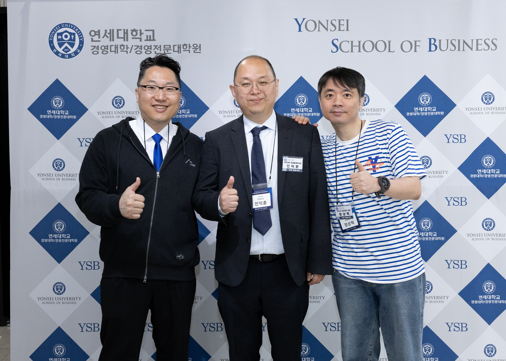
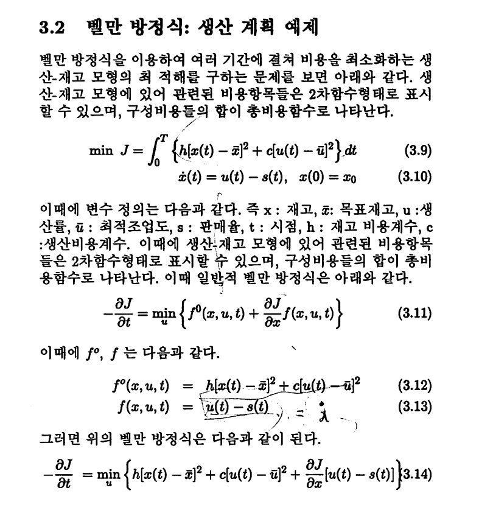
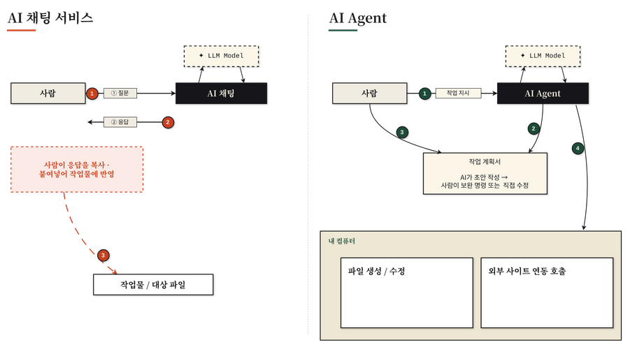
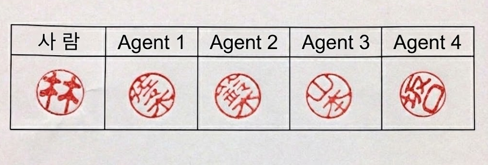
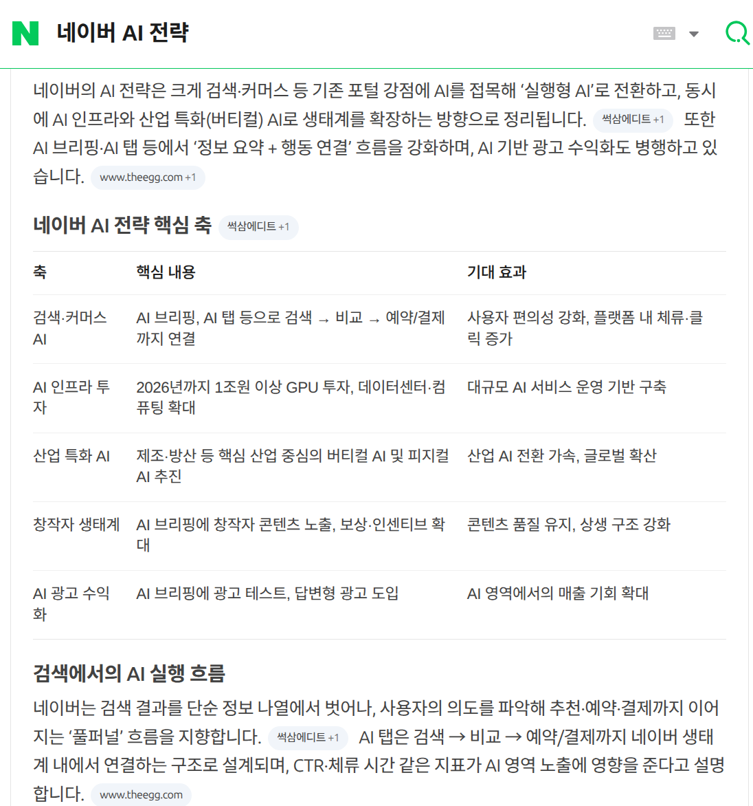

# 25년 전의 진로 선택과 AI 시대의 변화

---

## 발표자 & 주제

---

### 발표자 소개

* 2008 - 현재 : 네이버
    - 네이버페이 등 다양한 시스템 개발 참여
    - 공통 기술 플랫폼 조직에 소속
    - 현재 담당 업무의 가장 큰 주제 : AI로 전사 생산성 개선하기
* 2004 - 2008 : 삼성SDS
   - 공공사업 S/W 엔지니어
   - 교육부, 행자부, 감사원 프로젝트 참여
* 1997 - 2004 : 연세대학교 상경계열 재학
   - 경영학, 응용통계학 이중 전공

---

얼마 전 졸업 25주년 재상봉 행사에 참여

---

### 발표 주제
사전 질문을 바탕으로 구성

* 대학 때 진로를 택한 과정
* AI 시대의 변화
* 사전 질문 답변

---

### 우려
* 전공을 전형적으로 살린 사례는 아님
    * 다른 선배들의 이야기도 많이 듣고, 다양한 사례 중의 하나로 균형감있게 감안하길
* 25년의 세월 흐름
	* 그 사이의 변한 것과 앞으로도 변하지 않은 것을 찾는 것은 여러분의 숙제

---
## 진로 선택 경험

---

### 상경계열 선택

* 고등학교 때 공대 지망생
    * 어릴 때부터 과학자가 꿈
        * 그 시절에는 전형적. 로봇만화의 영향으로 추정
    * 중고등학교 때 프로그래밍이 꾸준한 취미
    * 고1때 희망학과는 '전자공학과'
* 집안 사정으로 문과로 오게 되었음.
* 문과에서는 딱히 관심가는 전공이 없었음.
* 무난해 보이는 '경영학과'가 있는 '상경계열' 선택

---

### 응용통계학과 선택
* 당시 상경계열에는 경영/경제/응용통계학 3개의 전공 중 선택 가능
    * 경영대학 분리 이전
    * 이중 전공 권장 분위기
* 응통과가 적성에 맞을 것 같아서 이중전공 선택
    * 수업 때 컴퓨터를 많이 쓸 것 같았음.
    * 1학년 때 통계학 기초 수업이 그나마 학점이 좋았음.

---

### 기억에 남는 수업

* 많은 통계 수업에서 사용한 SAS가 C언어하고 비슷해서 재미있었음
* 컴퓨터 자료 처리 (박상언 교수님): S-Plus 처음 배움

* 회귀분석 (이학배 교수님)

---

### 학교 전공이 도움이 된 순간

* 6 sigma(통계적 품질 관리)가 회사 필수 교육이었을 때
* 회사 내부에서 통계 지표를 보거나 만들 때
    * 데이터로 가설 검증을 할 때 쉽게 단정하지는 않음
    * R(S-Plus 친척)을 쓰기도 했었음
* 빅데이터 분석 / AI 기술을 이해할 때
    * 통계적 이론이 기반에 깔린 경우가 많음

---

* 예시: 대학 때 계량경영학 책에 나온 '벨만방정식'
    * 강화학습에서 최적의 행동을 결정하는 핵심 도구
    * 당시에 이해 못했음

---

### 전공별로 배운 것을 1가지씩만 꼽는다면?

#### 응용통계학과
* 통계적으로 상관관계가 있다고해도 인과 관계가 있다고 결론 지을 수는 없다.
    * 다른 근본 원인 : 예) 나쁜 이름을 가진 코드에 버그가 많다. 하지만 나쁜 이름이 버그를 만든다는 증거는 아니다. 근본 원인은 실력 없는 프로그래머일 수도 있다. ([프로그래머의 뇌](http://www.yes24.com/product/goods/105911017)라는 책에 나오는 내용)
    * 역인과관계 : 예) 퇴사자가 적은 회사가 성공한다? - 성공한 회사라서 퇴사자가 적은 것일 수도 있음.
    * 그렇다면 인과관계는 어떻게 판단할 수 있을까?
        * 데이터의 대상이 되는 분야에서 이를 설명할 수 있는 논리나 이론 등이 있어야 함

#### 경영학과
* 분권의 시대. 조직의 권한은 분산되고 있다.
    * 예: 토요타의 품질관리. 실무자가 생산 라인스톱 가능.
    * 현대 지식 근로자는 실무자라도 정해진 일을 시키는대로만 한다고 볼 수 없음.

---

### 개발자 진로 선택

* 대학 때에도 컴퓨터 관련 수업이 재미있었음.
* 선배들은 직장 생활을 다들 힘들어하는데 재미있을만한 순간이 일부라도 있으면 좋지않을까?
* 학점이 안 좋아서 선택지도 넓지 않았음.
* 삼성SDS 지원/합격 후 다른곳에는 지원하지 않음.

---
layout: image-right
image: https://image.yes24.com/momo/TopCate06/MidCate08/575731.jpg
backgroundSize: contain
---

### 진로에 확신을 더한 계기

책 '앞으로 50년'

* 4학년 '중급경영통계학' 수업 때 교수님이 권장해주신 책
* 2002년 출판되었으니 24년 지났음.

---

( 제이런 래니어(Jaron Lanier) 가 쓴 ‘복잡성의 절정(The Complexity Ceiling)’ 챕터 중 )

> (310페이지) 컴퓨터 과학의 다음 50년에도 잠재력의 과장과 비용의 과소 평가라는 이 두 경향은 계속될 가능성이 높다. 이것은 인류가 주로 매우 덩치 큰 소프트웨어 체계를 유지하는 일에 종사하게 된다는, 즉 지구가 ‘서비스 센터 행성’ 이라고 불리게 될 것이라는 시나리오이다. 전혀 매력이 없는 미래상은 아니다. 그것은 사람들의 고용을 계속 보장해 줄 것이기 때문이다.  그러나 이 활기 없는 미래가 필연적인 것은 아니며, 근본적으로 새로운 가능성들을 제공할 컴퓨터 과학의 새 단계를 상상해 보는 것도 나름대로 가치가 있을 것이다.

* ‘서비스 센터 행성’ -> '고용을 계속 보장해 줄 것이기 때문이다.'
    * 저자는 이에 대한 해결책을 제시하지만 미래 직업으로서는 괜찮지 않은가?

---

> (316페이지) 이런 체제를 ‘통계적 표면 결합’ 이라고 부를 수도 있다. 그것이 신체 장기 시뮬레이션에 쓰일 수 있다면, 범용 컴퓨터 설계에도 쓰일 수 있을 것이다. 아마 미래에는 요소들이 서로를 인식하고 해석하고 예측까지 하는 운영 체제가 나올 것이다. 그런 체제는 파국적인 고장을 덜 일으킬 것이다. 현재로서는 이런 틀이 얼마나 잘 작동할지 알 방법이 없지만, 컴퓨터 구조가 우리가 현재 다루는 법을 알고 있는 규모를 훨씬 넘어서 성장한다면, 어떤 유형의 통계적 결합이 채택될 것이 당연하다.

* ‘통계적 표면 결합'?
     * 통계는 불확정성을 동반하는데? 설마 그렇게 될리가...
     * 고장을 덜 일으키기 위해서는 최대한 명확하고 엄격한 통신규약이 필요하다고 생각했음
* ‘통계적 표면 결합'이 실현되기보다는 '서비스 센터 행성'이 더 현실적으로 와닿음

---

## AI 시대 변화

---
layout: image-right
image: https://image.yes24.com/goods/148032297/XL
backgroundSize: contain
---

### 바둑계에 먼저 온 미래

[먼저 온 미래](https://www.yes24.com/product/goods/148032297) 책 중

> (p25) 나는 바둑계에 미래가 먼저 왔다고 생각한다. 2016년부터 몇 년간 바둑계에서 벌어진 일들이 앞으로 여러 업계에서 벌어질 것이다. 사람들이 거기에 어떤 가치가 있다고 믿으며 수십 년의 시간을 들여 헌신한 일을 더 잘해내는 인공지능이 어느 순간 갑자기 등장하는 것. 

---
layout: quote
---

> (p25) 그 인공지능이 싼 가격에 보급되는 것. 그 인공지능과의 ‘공존’을 강요당하는 것. 인공지능이 만드는 새로운 질서를 따라야 하는 것.  당신이 알던 개념을 인공지능이 재정의하고, 당신은 그것을 다시 배워야 하는 것. 인공지능은 타자기나 워드프로세서와는 다르다.

이다혜 5단
> (p42) “집에서 중계를 보다가 멘탈이 나가서 침대에 멍하니 누워 있다가 ‘이게 현실인가? 전화를 한번 해봐야겠어’ 하고 동료 기사들에게 전화를 걸었어요. 다들 비슷한 반응이었어요. ‘너무 충격적이고 슬프다, 이게 현실처럼 느껴지지 않는다.’ 뜬눈으로 밤을 새웠어요. 내가 알고 있던 세계가 무너져 내린 것 같은 기분이었어요. ‘지금까지의 나의 노력은 어떤 가치가 있었을까, 그 시간은 헛된 시간이었을까’ 그런 생각이 들었어요.”

---

### S/W 업계의 현재
* 2024년 : AI가 코드 일부를 자동 완성
* 2025년 : AI가 직접 소스 파일을 고치기 시작(에이전트 시대 시작)
* 2026년 : 모든 실무자는 AI 에이전트들의 관리자
    * 에이전트들끼리는 자연어로 소통 -> '통계적 표면 결합'의 예언 실현

---

### AI 채팅 서비스 vs AI 에이전트
AI 에이전트는 사람의 작업을 대리함

---

### 과거를 돌아보면
* 과거의 실무자의 일은 현재 컴퓨터가 하는 일
예: CAD 도입전 General Motors의 기술자들이 작업하는 모습 ( [자료 출처 : archdaily](https://www.archdaily.com/940493/etheral-luminosity-from-above-general-motors-technical-center) )

* 기술이 발전하면서 지식근로자의 역할은 그 전 시대의 관리자의 역할과 유사하게 변화해왔음

---

### 2026년 S/W 업계에서의 사람의 역할
작업자(AI 에이전트)의 관리자 역할

* 작업자가 따를 지침/프로세스 정의
* 작업자에게 필요한 정보가 어디에 있는지 알려줌
* 작업자별 역할을 명확히 정의하여 할 일을 분배
    * 작업자별 장점을 고려하여
* 작업 결과에 대한 최종 승인

---

### AI 시대에는 어떤 사람이 필요할까?
* 특정 분야에 대한 일반적이지 않은 높은 기준을 제시할 수 있어야 함
    * 예) 연간 수십조 원을 처리하는 상거래 시스템에 필요한 기준
* AI가 할 수 없는 마지막일은?
    * 판단에 대한 책임
* 다양한 관점을 고려한 종합적인 판단을 내릴 사람
    * 단기 vs 장기, 위험감수 여부 등 트레이드 오프가 있는 결정
    * T자형 인재 -> 파이형, 문어발형 인재?
* 사람 사이의 소통 구간이 더 큰 병목
    * 다른 사람을 이해하고 설득할 수 있는 사람의 가치가 더 커졌음

---

### 대학 1학년으로 돌아간다면?

* 불편함을 감수하는 의식적인 지적 훈련을 꾸준히
    * '지적인 지구력' 기르기
    * AI 시대에 사람의 평균적인 지적능력은 퇴화할 것으로 예상됨
* '관심 없는 분야'를 단정하지 않기
    * '조직행동론'이나 '마케팅' 수업을 듣고 나와는 맞지 않는 분야라고 생각했지만 지나고나니 중요한 분야라는 것을 알게됨
    * 옛날에 별로라고 생각했던 책도 다시 읽으니 안 보이던 것이 많이 보임
* 지름길보다 둘레길을
    * 목적지에 도달하는 '가성비'보다 풍부한 여정을 경험하길
    * 목적지를 알기 어렵고 가봐도 예상과는 다를 것임

---

## 추천 자료

---
layout: image-right
image: https://image.yes24.com/goods/181119990/XL
backgroundSize: contain
---

### 추천 도서

[살면서 한번은 벽돌책](https://www.yes24.com/product/goods/181119990)

> (p54) 어떤 일을 할 때, 우리는 경합하는 논리를 종합해서 선택을 내려야 하고, 그 선택에는 책임이 따릅니다. 인간이 주인인 세상에서 그 책임을 지는 일만큼은 AI가 아닌 인간이 맡을 것이고, 우리는 여러 논리를 검토하고 종합하는 능력이 있는 사람을 책임자로 뽑게 됩니다.

* [소개된 책 구매 링크 모음](https://gist.github.com/benelog/91789a9abd9bea1ef3f33be7bcbf54df)

---
layout: image-right
image: https://image.yes24.com/goods/97684576/XL
backgroundSize: contain
---

[탤런트 코드](https://www.yes24.com/Product/Goods/97684576)

> (p31) 바보 같아 보일 만큼 수없이 실수를 허용할수록, 즉 정확히 목적에 맞는 노력을 기울이면서 끈질기게 물고 늘어질수록 더 많이 향상된다. 혹은 약간 다르게 표현하자면, 속도를 늦추고 실수를 하면서 그 실수를 교정하는 의도적인 과정을 되풀이할수록 결국은 본인도 깨닫지 못하는 사이에 점점 더 민첩하고 우아한 스킬을 습득한다.

---
layout: image-right
image: https://image.yes24.com/goods/124187392/XL
backgroundSize: contain
---

[데이터는 예측하지 않는다](https://www.yes24.com/Product/Goods/124187392)

> (p33) 데이터 사이언스를 사용한다(혹은 학습한다)는 것은 데이터를 이용해 내가 일하는 분야에서 발생한 특정 문제를 해결하고자 하는 목적일 가능성이 높다. 이때 가장 중요한 것은 문제의 본질을 얼마나 제대로 파악하고 있는가이다. 문제의 본질은 데이터 사이언스를 통해 알려고 하는 것, 데이터 사이언스를 통해서 하려는 정확한 의사결정이 무엇인가 파악하는 것이다.

---

### 발표자의 관련 글
* [다시 4학년, 아마도 계속](https://diary.benelog.net/2026/college-senior-again/) (2026년 졸업 25주년 재상봉 기념문집 기고문)
* ['먼저 온 미래' 감상문](https://diary.benelog.net/2025/future-came-first/)

### 과거 발표
* [프로그래밍과 진로](https://benelog.github.io/presentations/20220413-yonsei-stats-rc101/slides.pdf) (2022년 4월 13일 연세대학교 RC101 초청세미나)
    * [질의&응답](https://github.com/benelog/presentations/blob/main/20220413-yonsei-stats-rc101/qna.md)
* [네이버 개발자 업무와 기술 플랫폼](https://benelog.github.io/presentations/20210914-yonsei-stats-bk/slides.pdf) (2021년 09월 14일 연세대학교 통계데이터사이언스학과 BK산학 세미나)

---

## 사전 질문

---

### 학교 생활
- 학교생활 어떻게 하셨는지
- 대학생 기간동안 꼭 해봤으면 하는 일들, 하지 못해서 후회했던 일

---

### 취업과 진로
- 취업을 위해 했던 노력과 쌓은 스펙은?
- IT 기업에 취업하기 위해서는 어떤 경험이 중요한지
- 응용통계학과 학사만 전공 이수하여 좋은 기업에 취업할 수 있을지
- 취업을 위해서는 어떻게 대학생활을 보내야 할지
- AI의 등장 이후 통계 전공자의 역할과 업무가 어떤 영향을 받았고, 어떤 전망을 가질지
- 융합적 인재가 무엇이라고 생각하는지
- 업무 중 만족하신 부분과 아쉬웠던 부분
- 임원이 되려면 어떤 능력이 필요할지, 힘든 점

---

### 네이버 관련

공식 자료 참조

#### 네이버의 복지
* https://recruit.navercorp.com/cnts/benefits

#### 네이버의 업무

* https://recruit.navercorp.com/cnts/people
* https://fficial.naver.com/

---

#### AI시대 네이버 전략 : [네이버 검색 결과](https://search.naver.com/search.naver?sm=tab_hty.top&where=nexearch&ssc=tab.nx.all&query=%EB%84%A4%EC%9D%B4%EB%B2%84+AI+%EC%A0%84%EB%9E%B5&oquery=%EB%84%A4%EC%9D%B4%EB%B2%84%EC%9D%98+AI+%EC%A0%84%EB%9E%B5&tqi=jmhCblqX6IRssie%2BLwR-195166&ackey=vp5i9hp7)

---

## 추가 질문 & 답변

---

### 실시간 질문

* 음성 & 채팅창

### 세미나 후의 질문

* sanghyuk.jung@navercorp.com 로 이메일
