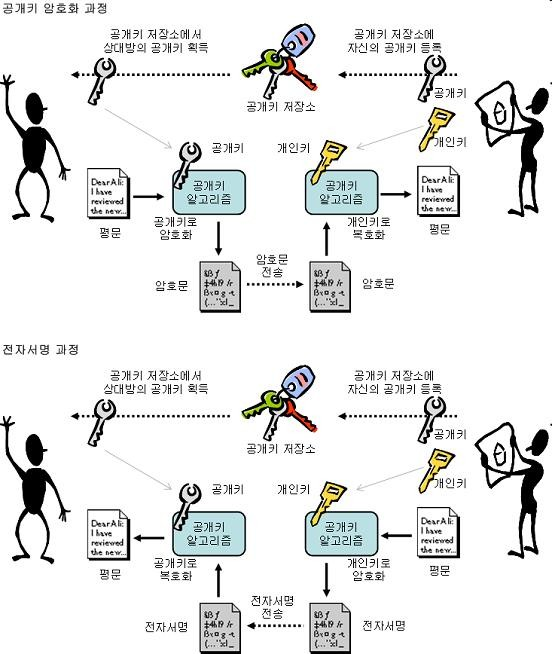

# 보안과 인증

> **게시판**: Open API 기술의 이해  
> **작성자**: benelog  
> **작성일**: 2011-08-30  
> **원문**: https://cafe.naver.com/openapibiz/15

---

> Open API provider 개발에서 감안해야 할 보인지침과 암호화, 인증방식에 대해서 알아봅니다. 프로젝트의 보안 기술의 적용 정책수립에 도움이 되는 참고정보를 얻도록 합니다.

보안지침

  

일반적인 웹어플리케이션 보안 + alpha

-   웹개발에 필요한 보안 가이드를 따를 것
-   SQL Injection

-   http://me2.do/FNN8Op

-   컨텐츠 입력 API에서는 XSS filtering도 중요

-   White list 방식이 바람직
-   Lucy XSS Filter

-   http://dev.naver.com/projects/lucy-xss 
-   [http://deview.naver.com/2010/file/ThePlatform2010DeView.pdf](http://deview.naver.com/2010/file/ThePlatform2010DeView.pdf) 43페이지암호화

-   구체적인 구현기술이나 미들웨어가 노출되지 않도록한다.

-   사례1 : Struts2 Security bug

-   http://sebug.net/exploit/19954/
-   http://svn.apache.org/viewvc?view=revision&revision=956389
-   http://securityreason.com/exploitalert/8435

-   사례2: Apache 보안 취약점

  

  

NHN 사례 참고 자료

-   단 하루도 안심할수 없게 만드는 웹보안 위험들

-   발표자료 : http://deview.naver.com/2010/file/B4.pdf
-   동영상 : http://blog.naver.com/deview\_con/40114281465

-   통계로 알아보는 DDOS

-   발표자료: http://deview.naver.com/2010/file/D3.pdf
-   영상 : http://blog.naver.com/deview\_con/40114281548
-     
    

  

암호화

  

암호화기술 개요

-   암호화 기술을 이해해야 하는 이유

-   Open API KEY, oAuth 모두 암호화 기술을 기반으로 함.
-   암호화 처리 방식을 이해해야 oAuth 처리 프로세스를 이해할 수 있음

-   암호화/복호화란?

-   평문의 메시지를 암호문이라 불리는 안전하게 코드화한 텍스트로 변환 하는 과정
-   이때 사용되는 메시지의 재구성 방법을 암호화 알고리즘이라 함.
-   암호화 알고리즘에서는 Key를 사용함.
-   복호화는 암호화의 역과정으로서, 암호화에 사용된 동일한 알고리즘을 이용하여 본래의 메시지로 환원하는 과정

-   암호화 시스템의 주요요소

-   암호화 알고리즘, 암호화 키, 키 길이

  

대칭키 암호화

  

암호화 키와 복호화 키가 동일

-   장점 : 암복호화를 위해 하나의 키만 사용, 암호화 및 복호화 속도가 빠름
-   단점 : 키관리의 어려움. 키분배의 문제. 다양한 응용의 어려움
-   알고리즘 : DES, AES, SEED, 3DES, SEA, RC4, Blowfish, IDEA, FEAL

-   [http://cryptocat.tistory.com/2](http://cryptocat.tistory.com/2) 참고
-   [http://kowon.dongseo.ac.kr/~lbg/web\_lecture/it/lec3/lec3.htm](http://kowon.dongseo.ac.kr/~lbg/web_lecture/it/lec3/lec3.htm) 참고

  

  

  

(이미지 출처 : [http://cryptocat.tistory.com/2](http://cryptocat.tistory.com/2) )

  

비대칭키 암호화

  

암호화 키(=공개키)와 복호화 키(=비밀키)와 가 다름

-   장점 : 키관리가 용이. 다양한 응용이 가능. 안전성이 뛰어남
-   단점 : 암호화 및 복호화 속도가 느림
-   사례 : RSA, ECC, KCDSA, ElGamal, DSS 등

  

(그림 출처 : [http://cryptocat.tistory.com/3](http://cryptocat.tistory.com/3) )

  

전자서명

-   개인키로 암호화하고 공개키로 복호화 (암호화와 반대)
-   전자문서를 작성한 자의 신원과 전자문서의 변경 여부를 확인할 수 있도록 비대칭 암호화 방식을
-   이용하여 전자서명 생성키(개인키)로 생성한 정보로서 그 전자문서에 고유한 것
-   문서->사전 해쉬값->개인키 암호화->공개키 복호화 -> 사전 해쉬값 -> 사후 해쉬값과 비교

  

해쉬 함수

-   특징 : 일방향 함수 + 메시지 압축
-   메시지의 변조(modify)나 원본 메시지의 대체(substitute)를 방지하기 위해 사용
-   전자서명 생성시에 사용
-   oAuth 흐름상에서 이 방법을 이용하여 인증 처리함
-   충돌이 일어날 수 있으나, 시간상 비용상 찾아내는 것을 의미없게 하는 것이 목표
-   알고리즘: MD4(128 bit 결과), MD5(128 bit 결과), SHA(160 bit 결과)
-   [http://cryptocat.tistory.com/1](http://cryptocat.tistory.com/1) 참조
-   Salt : 임의의 문자를 암호 앞이나 뒤에 넣어서 길이를 길게 함
-   Random salt :Salt를 추측하기 어렵도록 Random하게 
-   iteration : random salt와 hash과정을 반복

  

HMAC

-   [http://en.wikipedia.org/wiki/HMAC](http://en.wikipedia.org/wiki/HMAC)
-   Message Authentication Codes (MAC)

-   개방된 컴퓨팅 및 통신 환경에서 비밀키에 의해 메시지의 무결성(integrity)를 검증하는 방식
-   비밀키를 공유하고 있는 양단에서 송수신한 메시지의 무결성을 검증하기 위한 목적

-   HMAC = Hashed MAC
-   MAC의 방식 중 암호화 기법으로 해시 알고리즘을 이용
-   메시지 인증값(message authentication values)을 계산/검증하기 위해 비밀키를 이용
-   목적

-   기존 해시 함수의 특성을 그대로 이용
-   단순한 방식으로 비밀키를 이용
-   해시 함수에 기반한 암호학적 강도 분석이 용이
-   향상된 해시 함수로의 대체 용이

-   해시 함수

-    HMAC-SHA1\[SHA-1\], HMAC-MD5\[MD5\], HMAC-RIPEMD\[RIPEMD-128/160\], HMAC-SHA1

  

  

•HMAC 작동방식 : 서로 안전하게 나눠가진 비밀키가 있다는 전제조건

  

  

인증

  

Basic 인증

-   예: [http://www.connotea.org/data](http://www.connotea.org/data)
-   Http Header에 값을 넣음
-   평문으로 데이터 전송 : Sniffing 위험성

  

  

OAuth

  

-   오픈 OAPI로 개발된 표준 인증 방식
-   비밀번호를 직접쓰지 않는다.
-   Consumer 웹사이트에게 Provider 웹사이트 상의 개인 인증 정보를 제공할 필요 없이, Consumer 웹사이트에서 Provider 웹사이트상의 개인 데이터로의 접근을 허용하는 방법을 제공하는 인증 위임(delegation) 프로토콜
-   실제 사용자의 인증은 Provider  서비스에서 수행하고 Consumer  서비스에게는 사용자 ID와 password가 아닌 Provider  서비스에서 발급하는 인증 토큰만 제공한다.

-   Consumer는 사용자의 ID, PWD를 알지 못해도 서비스에 접근 가능해짐

  

중간에 중재를 할 수 있어야한다.

과정에 속임수가 없다는 것을 인지할 수 있도록 명확한 절차를 제공  

  

-   용어

-   사용자(user): 서비스 공급자와 소비자를 사용하는 계정을 가지고 있는 개인
-   소비자(consumer): Open API를 이용하여 개발된 OAuth를 사용하여 서비스 제공자에게 접근하는 웹사이트 또는 애플리케이션
-   서비스 공급자(service provider): OAuth를 통해 접근을 지원하는 웹 애플리케이션(Open API를 제공하는 서비스)
-   소비자 비밀번호(consumer secret) : 서비스 제공자에서 소비자가 자신임을 인증하기 위한 키
-   요청 토큰(request token) : 소비자가 사용자에게 접근권한을 인증받기 위해 필요한 정보가 담겨있으며 후에 접근 토큰으로 변환된다.
-   접근 토큰(access token) : 인증 후에 사용자가 서비스 제공자가 아닌 소비자를 통해서 보호된 자원에 접근하기 위한 키를 포함한 값.

-   절차 (http://ko.wikipedia.org/wiki/OAuth 참조)

1.  소비자가 서비스제공자에게 요청토큰을 요청한다.
2.  서비스제공자가 소비자에게 요청토큰을 발급해준다.
3.  소비자가 사용자를 서비스제공자로 이동시킨다. 여기서 사용자 인증이 수행된다.
4.  서비스제공자가 사용자를 소비자로 이동시킨다.
5.  소비자가 접근토큰을 요청한다.
6.  서비스제공자가 접근토큰을 발급한다.
7.  발급된 접근토큰을 이용하여 소비자에서 사용자 정보에 접근한다.

(그림 출처 : [http://www.ibm.com/developerworks/kr/library/wa-oauth1/](http://www.ibm.com/developerworks/kr/library/wa-oauth1/))-

