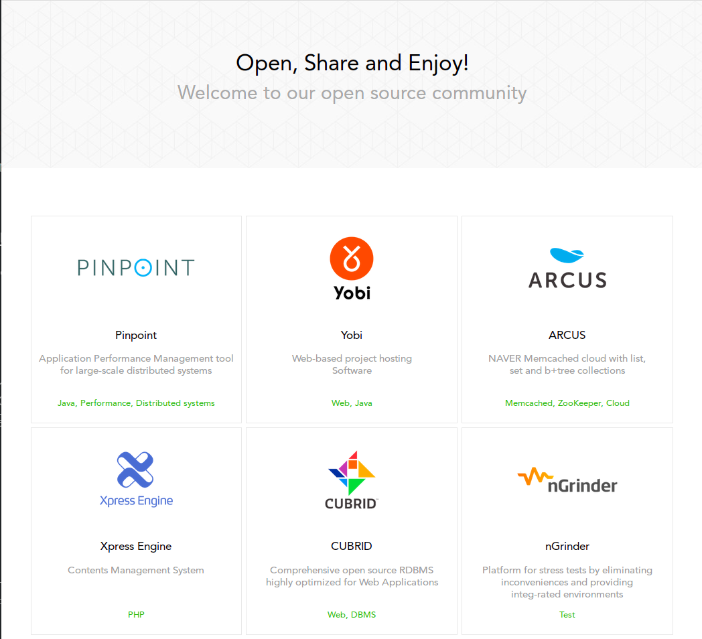
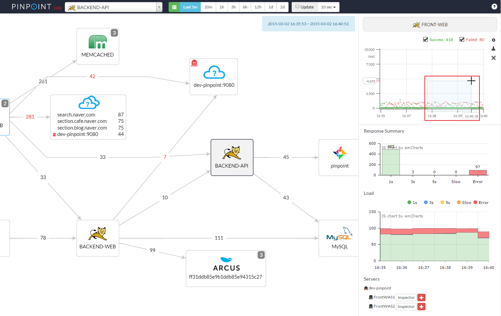

= 네이버의 오픈소스 프로젝트가 성장한 과정
:author: 정상혁
:revision: 1.1
:backend: slidy
:max-width: 45em
:data-uri:
:icons:

== 들어가며 : 배경

=== 발표자 : 정상혁
[role="incremental"]
* 네이버 서비스플랫폼개발센터
** 내부 라이브러리 개발 담당자
** Tech@Naver 시리즈의 책 3권에 공저자로 참여
* 경력
** 2008 ~ 2015 : 네이버(구 NHN)
** 2004 ~ 삼성SDS (2014)
*** 아마도 44기 18차

=== 'Open it' 컨퍼런스와의 인연
[role="incremental"]
* 2010년 경 Open IT의 전신이였던 Open & More 참여

=== 발표 주제
[role="incremental"]
* 네이버의 오픈소스 프로젝트가 성장하는 것을 보면서 느낀 점
** 주로 nGrinder, Pinpoint에 초점을 맞추어서
* '이러이러한 요건을 갖추면 성공적인 제품/오픈소스가 된다?'라는 것을 말하고 싶은 것은 아님
** 예시의 수가 적다
** 복합적인 환경에 의해 탄생한 제품들이므로 새로운 제품이 이를 똑같이 재현할 수는 없음
** 현재 내가 만들고 있는 제품의 우선 순위/비전을 돌아보는 정도의 의미로 생각하면 좋겠음

=== 네이버의 플랫폼
네이버의 서비스를 여러 방향에서 지지하고 있음

[role="incremental"]
* 뒤 : 저장소 - RDBMS, 분산캐쉬, 분산파일시스템, 분산 DBMS
* 앞 : 메시지 중계 - push 서비스 (모바일단말/웹브라우져), API gateway 등
* 옆 : 횡단/공통 관심사 - 모니터링, 권한관리, 로그 수집, 협업 시스템

다른 상용/오픈소스와 비교했을 때도 글로벌 경쟁력이 있는 제품을 만드는 것이 목표. 일부는 오픈소스화.

=== 네이버의 오픈소스 프로젝트
http://github.naver.io

대작(?)들은 내부 적용을 마친 후 공개.

[role="incremental"]
* Pinpint : 분산추적에 초점을 맞춘 Java 성능 모니터링 도구
* nGrinder : 성능테스트 도구

DEMO

== Pinpoint/nGrinder의 성장 과정

=== 1. 필요성을 잘 아는 사람들이 시작
[role="incremental"]
* 유사한 제품들을 사용해왔음
* 오픈소스/상용 제품의 빈틈
** 불편하거나/비싸거나

==== Pinpoint
[role="incremental"]
* 트러블슈팅/성능 고도화 기술 지원을 많이 하던 사람들이 시작
** 분산환경에서의 추적이 어려움을 누구보다 잘 알고 있었음.

==== nGrinder
[role="incremental"]
* 성능테스트를 일상적으로 하던 조직에서 개발
** Load runner는 예약제로 사용해야 했음
** 오픈소스인 Grinder만으로는 불편함을 느낌

=== 2. 가혹한 적용 환경

==== Pinpoint
[role="incremental"]
* 같은 조직에서 운영하는 API gateway에 가장 먼저 적용
** 매일 수십억건의 데이터를 처리
** 글로벌 환경
*** 구간별 성능 측정이 더욱 중요했음

==== nGrinder
[role="incremental"]
* 상시적으로 성능테스트를 하는 서비스/제품이 많음
** Agent가 부하생성의 한계에 부딛히거나 Network bandwith를 넘어서는 경우도
* 모바일 시대
** 대용량, 고트래픽을 맞아주는 API 서버개발의 수요가 늘었음
** 최소한도의 성능테스트는 직접 해서 오픈

=== 3. 강한 Technical leader(TL)
[role="incremental"]
* TL이 프로젝트 발전 방향에 대해서 강한 의사결정 권한을 가졌음
* TL이 nGrinder/Pinpoint에서는 가장 많은 부분을 직접 구현
* TL이 가진 제품에 대한 자부심

=== 4. 장기적 투자, 후원자
[role="incremental"]
* 오픈전에 3년이상의 투자를 거친 프로젝트
* 초기에는 성공을 확신하지 못했음.
** 2~3명이 작게 시작
* Front End 개발자의 채용에 6개월을 넘게 보내기도...
** 실무자 면접을 통과한 사람을 임원진에서 탈락시키기도 함
* 어느 개발자의 Commit
** https://github.com/naver/pinpoint/commit/7720b9f84e5e03d0c01f8ffb94b99abc023f8e23

=== 5. 내부의 긍정적인 변화
==== Pinpoint

[role="incremental"]
* 분산환경의 성능문제를 어플리이션 개발자가 스스로 알어내어서 문제 공유
* 글로벌 인프라 구성 변경 확인
** 글로벌 앱 지원을 위한 서버는 특정 지역의 요청이 정확하게 의도한 곳의 서버로 전달되는지  확인하기가 어려움
** Pinpoint의 서버맵에서 호출 경로 확인
*** 실제 호출이 가는지 바로 파악이 가능
*** 해외 IDC의 서버팜 등 초기환경 세팅시 유용하게 사용
* 지역별 실행시간 비교
** 별도의 프로파일링 도구나 코드수정없이 바로 파악이 가능했음.
*** 예) A국가 서버 -> 한국 중계서버 --> 한국 서비스 서버 : 약 250ms + alpha
*** 예) B국가 서버 -> 한국 중계서버 --> 한국 서비스 서버 : 약 70ms + alpha
** 분산 호출 사이의 실행시간 파악
*** 병목지점이 어플리케이션의 로직이 아닌 미들웨어나 Network layer에서 있음을 바로 파악
** 구간별 성능 개선 효과 파악

==== nGrinder
[role="incremental"]
* Load runner는 이제 안녕
* 개발자가 스스로 성능 테스트

=== 6. 오픈소스 공개를 위한 별도의 준비
[role="incremental"]
* 영문번역/문서화 작업
** https://github.com/naver/pinpoint/tree/master/quickstart[Pinpoint quick start guide]
** http://www.cubrid.org/wiki_ngrinder/entry/user-guide[nGrinder user guide]
** commit log도 영어로 쓰기 시작
* nGrinder/Pinpint 둘다 과거의 commit log를 그대로 남기고 있음
** 과거 기여자들도 뿌듯하도록
** github에서는 email중 하나만 일치하면 계정을 연결해줌
* 모듈 구조 개선

=== 7. 유연한 내/외부 모듈 연동 구조
[role="incremental"]
* 내부에서는 서비스형이라 사내 사용자는 설치작업 없이 사용
* 외부 사용자는 설치해서 쓸 수 있음
* 현재 nGrinder/ Pinpoint는 사내 Fork버전이 없다.
** 사내에서만 쓰는 plugin, component가 있을 뿐

==== Pinpoint
[role="incremental"]
* Maven multi project의 Multi-project
** 사내 배포용 빌드 때는 오픈소스 Component를 그 구성요소로 참조한다.
* 사내 전용 컴퍼넌트
** 사내 인프라 모니터링시스템 연동
** 사내 로그수집 시스테 연동
** 사내 프로토콜 Plugin
* Plugin 구조
** https://github.com/naver/pinpoint-plugin-sample[Pinpoint plugin 샘플프로젝트]
** 인턴 과제 등으로 독립적인 모듈 개발을 할당하기가 더 편해졌음
** 외부기여를 촉질한것으로 기대

==== nGrinder
[role="incremental"]
* SSO 모듈 (Siteminder) 연동을 Plugin 방식으로 지원
** https://github.com/naver/ngrinder-siteminder-sso

=== 8. 조직을 넘어선 기여와 소통
* 오픈소스 공개 후의 결과

==== Pinpoint
[role="incremental"]
* 외부 사용자의 Contrubution
** 코드 : Dockerize Pull request등
** 문서화, 강의 : https://github.com/naver/pinpoint/wiki 참조
*** 외부 사용자가 만든 메뉴얼 등장
*** https://www.youtube.com/watch?v=hrvKaEaDEGs[설치 가이드 동영상 강좌 1 (okjsp 대표 허광남님)]
* C사 등 네이버에서 이직해간 사람이 적극적으로 많이 사용함.
* 외부 사용자 인터뷰
* 해외 사용자
** 87개 국가에서 실행
** 영문 메뉴얼을 열심히 만든 보람이...
* 오픈소스 분산트레이싱시스템에 대한 워킹그룹 설립 논의에 초청을 받음

==== nGrinder
[role="incremental"]
* 퇴사자의 Commit
* 사용자끼리 질문/답변
* 외국의 채용공고에 nGrinder 등장
* 외부 세미나에서 다른 회사 사람이 nGrinder에 대한 발표를 해줌
** http://www.slideshare.net/LimSungHyun/ngrinderspringcamp-2015[내가 써본 nGrinder] (2015.04.18, Spring camp 2015)

== 마치며 : 정리
=== 요약하면
[role="incremental"]
* 해당 제품의 필요성을 절실히 느낀 사람들이 개발하고
* 내부의 가혹한 검증을 거치고, 긍정적인 변화를 이끌고
* 오픈소스에 적합한 구조개선/문서 정리를 한 후 공개
* 강력한 TL, 장기적인 투자, 상위 의사결정자의 후원
* 내/외부의 모듈 연동을 모두 만족시키는 유연한 모듈구조
* 외부 사용자/커뮤니티가 생김
** 적어도 제품을 발전시키는데는 도움이 되지 않았을까?

=== 생각해볼 거리
https://www.linkedin.com/pulse/open-source-igor-perisic[To Open Source or Not to Open Source] : Linkedin의 VP Engeer인 Igor Perisic가 블로그에 공개한 글

[role="incremental"]
* 더 좋은 소프트웨어를 만들게 될 것이다.
* 회사 차원에서 '엔지니어링 브랜드'를 만드는데 도움이 된다.
* 공수를 벌 수 있는 것이라는 기대를 가지고 오픈소스화 하지 마라
** 외부 요구사항이 밀려들 수 있다.
** 멋지게 포장하는데 노력이 들어간다.
* 단지할 수 있다는 이유로 오픈소스화하지마라
** 나쁜 프로젝트를 공개하면 역효과가 있다

== 참고 자료

=== Pinpoint
* http://d2.naver.com/helloworld/1194202[대규모 분산 시스템 추적 플랫폼, Pinpoint,] (2015.03.16, 네이버기술 블로그)
* http://www.slideshare.net/Woonduk-Kang/2015-pinpoint-springcamp[Pinpoint 대규모 분산 환경 추적 플랫폼] (2015.04.18, Spring camp 2015)
* http://www.slideshare.net/deview/d2pinpoint[Pinpoint 개발기] (2015.05.22, D2 공개세미나)
* http://www.slideshare.net/deview/d2-java-pinpoint[Java 어플리케이션 트러블슈팅 사례&Pinpoint] (2015.05.22, D2 공개세미나)

=== nGrinder
* http://www.slideshare.net/deview/hello-world-n-grinder-helloworldfree[nGrinder : 아이들도 할 수 있는 성능 테스트] (2013.07.13, Helloworld 오픈세미나)
* http://deview.kr/2013/detail.nhn?topicSeq=2[nGrinder : 아이들도 할 수 있는 성능 테스트] (2013.10.14, DEVIEW 2013)
* http://www.slideshare.net/LimSungHyun/ngrinderspringcamp-2015[내가 써본 nGrinder] (2015.04.18, Spring camp 2015)
